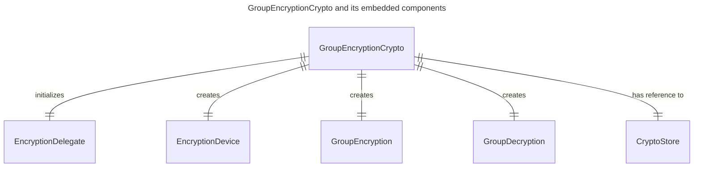
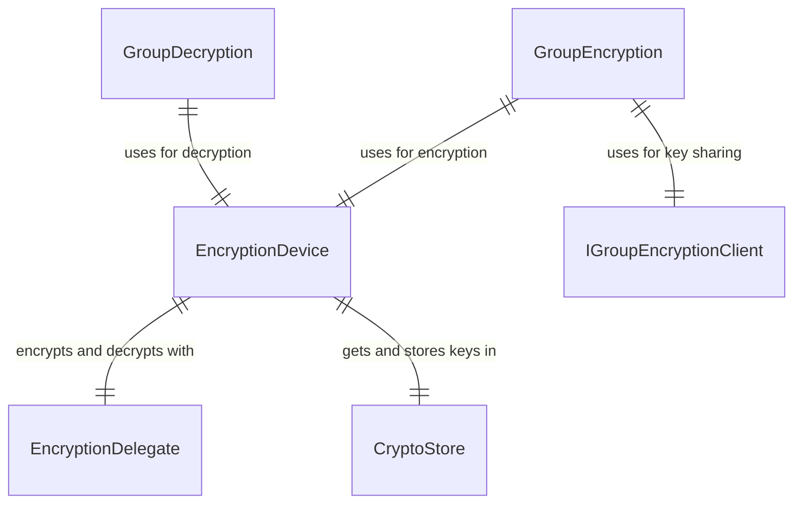
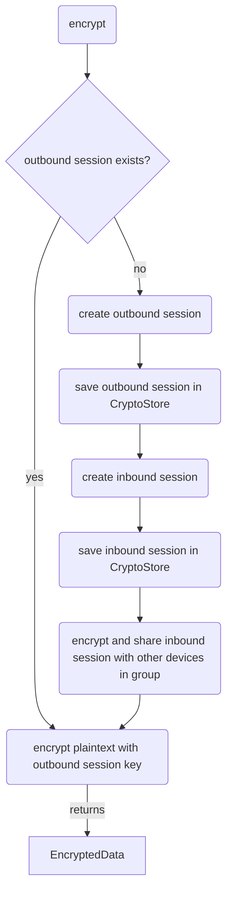
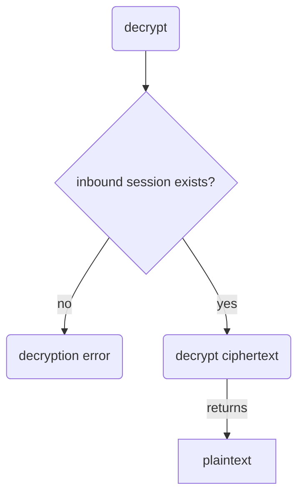
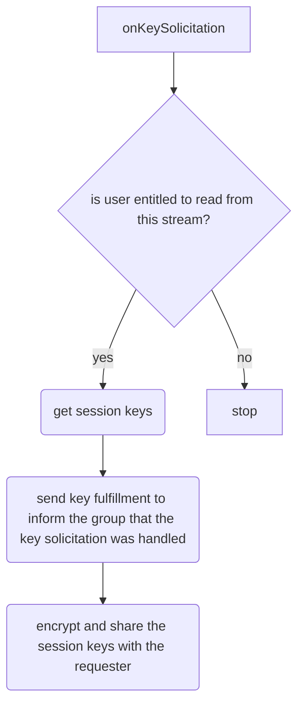

### What is the Towns Encryption Protocol?

The Towns protocol enables end-to-end encryption between groups of user devices. Here's how it works: When a user (Bob) wants to send a message to a group, his device creates a new group session and encrypts the message using an outbound session key before sending it.

When a recipient (Alice) gets the encrypted message, her device will start a
new group session to import the inbound session key, and then use it to decrypt
the message.

How does Alice's device get the inbound session key?

The group encryption protocol works through several key mechanisms. Alice's device sends a `key solicitation request` to obtain any missing session keys. Other group devices can then `share session keys` through `key fulfillment` after verifying Bob's group membership.

Let's examine the core components of the group encryption protocol before exploring the `key solicitation`, `key fulfillment`, and `key sharing` algorithms in detail.

### Core Entities in the Towns Encryption Protocol

` GroupEncryptionCrypto`: The main interface of the protocol. It initializes the `EncryptionDelegate`. This class "delegates" the encryption and decryption operations to the` olm `[**library from the **](https://www.npmjs.com/package/@matrix-org/olm) [**Matrix.org**](http://Matrix.org)[** foundation**](https://www.npmjs.com/package/@matrix-org/olm). This library implements the Double Ratchet algorithm. See notes on [**supported algorithm**](https://docs.towns.com/build/towns-encryption#supported-algorithm) for future plans.

The Towns Encryption Protocol uses this library to create a group session, and
perform device-to-device encryption using the session keys.

The `GroupEncryptionCrypto` creates a `GroupEncryption`, a
`GroupDecryption`, and an `EncryptionDevice` to handle the group encryption
protocol:



- `GroupEncryption`: Manages group encryption with session keys, encrypting outgoing messages using outbound session keys.
- `GroupDecryption`: Manages group decryption with session keys, decrypting incoming messages using inbound session keys.
- `EncryptionDevice`: Interfaces with the `EncryptionDelegate` for cryptographic operations and uses the `CryptoStore` to manage inbound and outbound session keys.



### Encrypting a message with GroupEncryption

A device will need an outgoing session to encrypt a message to the group. If
it does not already have a session, it must create one. In addition, it will
also create an inbound session. The inbound session is encrypted and sent to
other devices in the group.



### Decrypting a message with GroupDecryption



### Key solicitation and key fulfillment

If a device does not have any session keys, it can make a `KeySolicitation`
request to the group. Any device that is "online" at that moment can share its
known session keys, and send a `KeyFulfillment` response to inform others in the
group that the `KeySolicitation` request has already been fulfilled.

Continuing our example, suppose Alice's device does not have the session key
to decrypt a message from Bob. Alice's device posts a `KeySolicitation` request
to the stream. Bob's device happens to be online at the moment. When it sees the
request, it processes the request as follows:



Through this process, Alice's device obtains the required session keys for decryption.

## Build

See [towns-tutorials/encryption-import](https://github.com/river-build/towns-tutorials/tree/main/encryption-import) for a tutorial on how to import the Towns Encryption
npm package.

---

## Footnotes

### Supported algorithm

> The Towns Encryption Protocol is designed to support new algorithms. There is
> an `algorithm` field in the protocol definition. The current value is
> `r.group-encryption.v1.aes-sha2`. This means that the protocol is using the
> `olm` Double Ratchet library for device-to-device session encryption.
> This field can be set to new algorithms to support future needs.

```protobuf
// protocol.proto
message EncryptedData {
    // ...
    /**
    * Encryption algorithm  used to encrypt this event.
    */
    string algorithm = 2;
    // ...
}
```