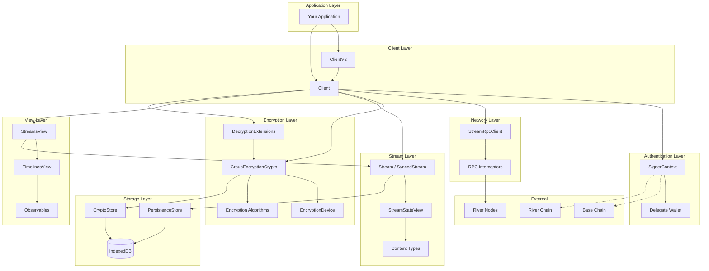
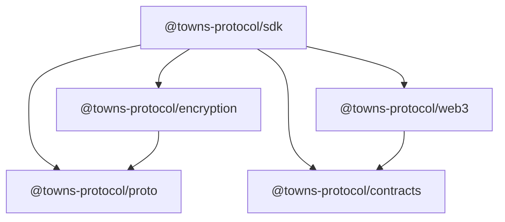

# SDK Architecture Overview

This document provides a high-level view of the Towns Protocol SDK architecture.

## System Architecture



## Layer Responsibilities

| Layer | Purpose | Key Components |
|-------|---------|----------------|
| **Client** | Entry point for SDK consumers | `ClientV2`, `Client` |
| **Authentication** | Wallet management, delegation, signing | `SignerContext`, delegate wallets |
| **Network** | Communication with River nodes | `StreamRpcClient`, interceptors |
| **Encryption** | End-to-end encryption | `GroupEncryptionCrypto`, `EncryptionDevice` |
| **Stream** | Stream state management | `Stream`, `SyncedStream`, `StreamStateView` |
| **View** | Reactive UI state | `StreamsView`, `TimelinesView`, `Observable` |
| **Storage** | Local persistence | `CryptoStore`, `PersistenceStore` |

## Package Dependencies



## Document Index

| Document | Description |
|----------|-------------|
| [01-client.md](./01-client.md) | Client entry points and initialization |
| [02-authentication.md](./02-authentication.md) | Wallet delegation and signing |
| [03-rpc.md](./03-rpc.md) | Network communication layer |
| [04-encryption.md](./04-encryption.md) | Encryption algorithms and flows |
| [05-crypto-store.md](./05-crypto-store.md) | Cryptographic key storage |
| [06-streams.md](./06-streams.md) | Stream state management |
| [07-timeline.md](./07-timeline.md) | Timeline and observable views |
| [08-persistence.md](./08-persistence.md) | Local data persistence |
| [09-decryption-extensions.md](./09-decryption-extensions.md) | Key exchange protocol |
| [10-layer-integration.md](./10-layer-integration.md) | Cross-layer data flows |

## Data Flow Summary

### Sending a Message

```
App → Client.sendMessage() → Encryption → RPC → River Node → Confirmation
```

### Receiving a Message

```
River Node → RPC → Stream → DecryptionExtensions → Timeline → Observable → App
```

## Key Concepts

### Streams
All communication in Towns happens through **streams**. Types include:
- **Space streams** - Top-level communities
- **Channel streams** - Public discussion channels
- **DM streams** - Direct messages (1:1)
- **GDM streams** - Group direct messages
- **User streams** - User metadata and settings

### Miniblocks
Events are batched into **miniblocks** for efficient consensus and replication. Events go through:
1. **Minipool** - Unconfirmed events waiting to be included
2. **Miniblock** - Confirmed batch of events
3. **Snapshot** - Periodic state checkpoints

### End-to-End Encryption
All message content is encrypted using:
- **GroupEncryption** - Megolm-based (Signal protocol)
- **HybridGroupEncryption** - AES-GCM with Olm key distribution

### Key Exchange
When a device can't decrypt a message:
1. Sends **KeySolicitation** to the stream
2. Other members respond with **KeyFulfillment**
3. Device imports session keys and retries decryption
