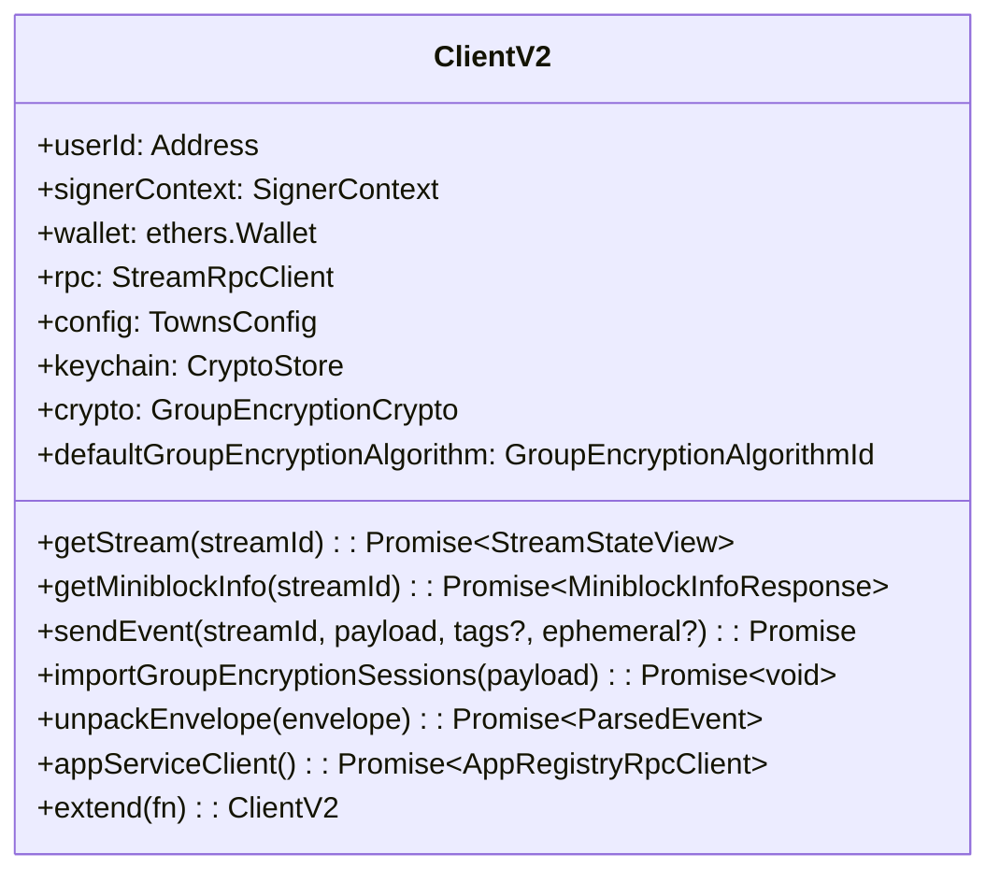
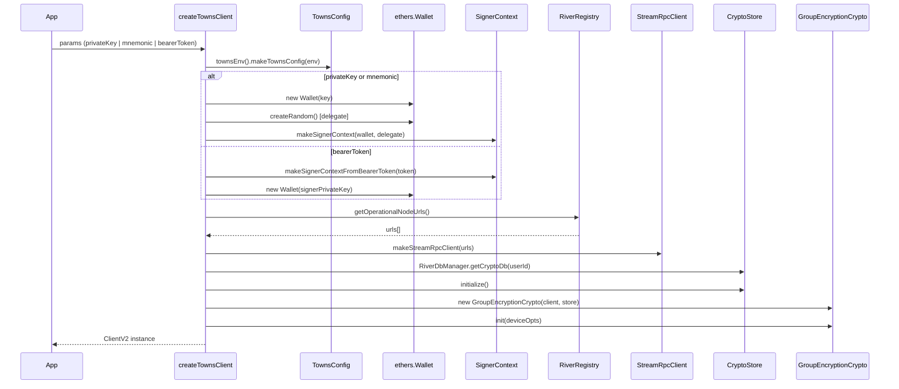
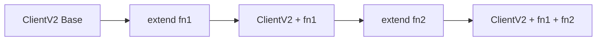
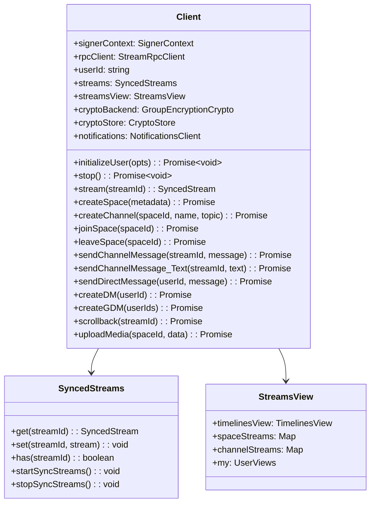
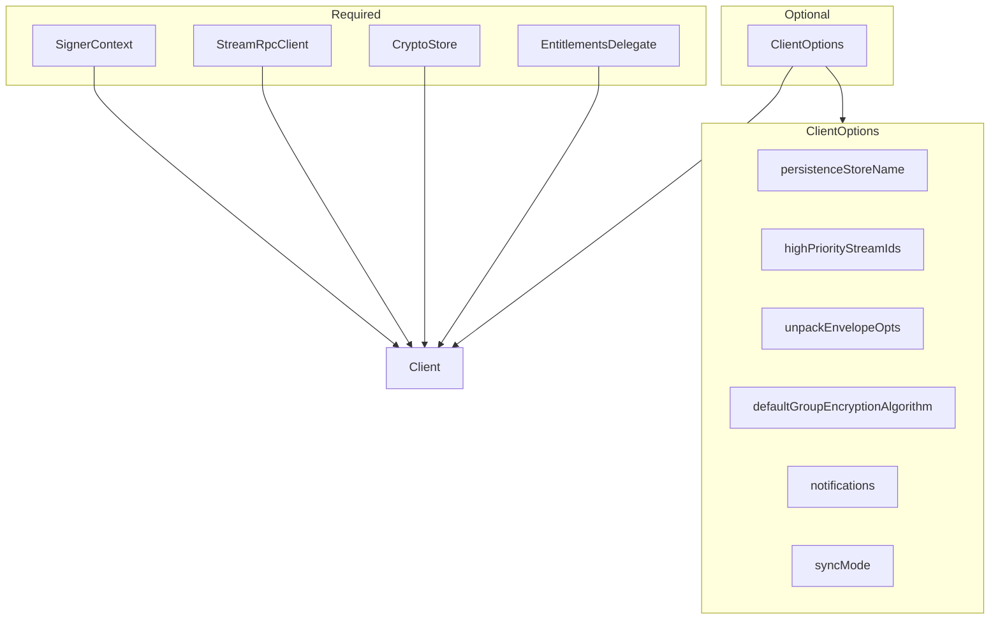
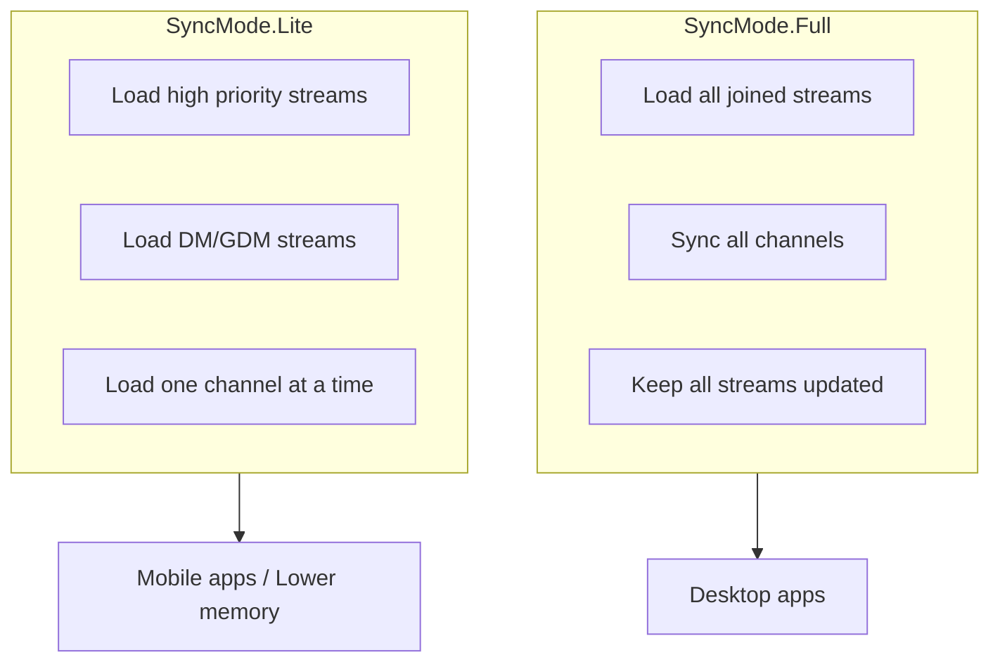
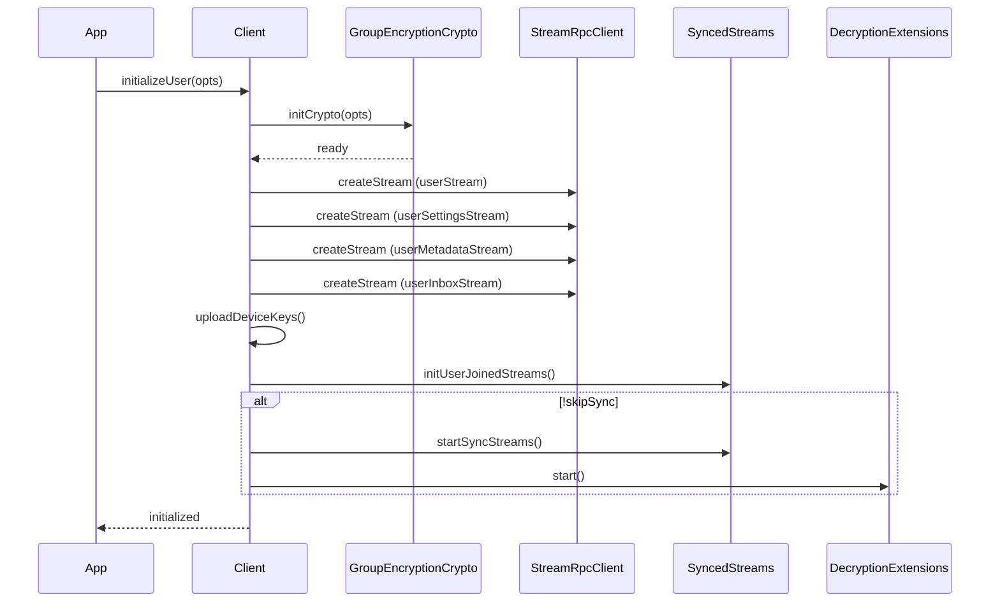
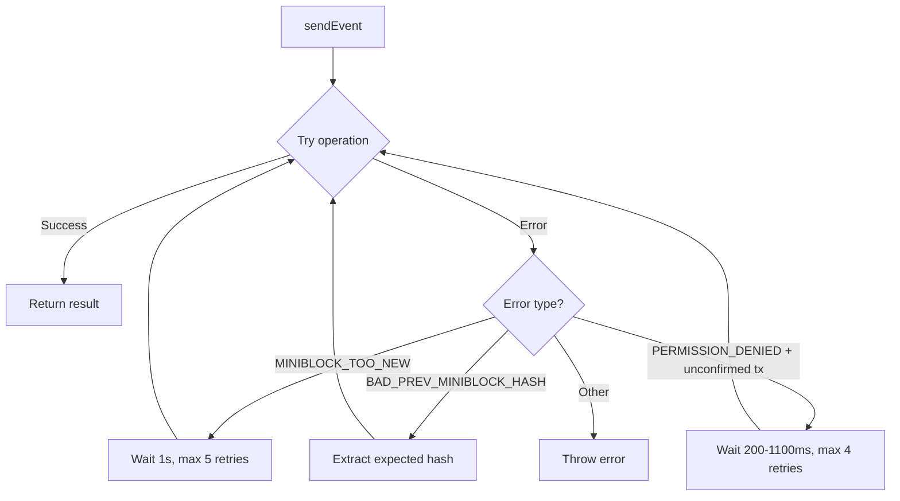

# Client Layer

The Client layer provides entry points for SDK consumers to interact with the Towns Protocol network.

## Entry Points

There are two main client types:

| Client | Use Case | File |
|--------|----------|------|
| `ClientV2` | Lightweight, extensible client | `src/client-v2.ts` |
| `Client` | Full-featured client with sync | `src/client.ts` |

## ClientV2 (Lightweight)

`ClientV2` is created via `createTownsClient()` and provides a minimal, extensible interface.

### Class Structure



### Initialization Sequence



### Extension Pattern

`ClientV2` uses a chainable `extend()` pattern for adding functionality:



```typescript
const client = await createTownsClient({ privateKey, env: 'gamma' })

const extended = client.extend((base) => ({
    customMethod: async () => {
        return base.getStream(streamId)
    }
}))

// extended.customMethod() is now available
```

## Client (Full-Featured)

The `Client` class provides full stream synchronization, persistence, and reactive views.

### Class Structure



### Constructor Dependencies



### Sync Modes



## Initialization Flow



## Key Methods

### Sending Events

All events go through `makeEventAndAddToStream()` which handles:
1. Getting the latest miniblock hash
2. Creating the event envelope
3. Signing with SignerContext
4. Retrying on transient errors
5. Adding to local stream state

### Retry Policy



## Source Files

| File | Description |
|------|-------------|
| `src/client-v2.ts` | ClientV2 factory and lightweight client |
| `src/client.ts` | Full Client class (3,372 lines) |
| `src/signerContext.ts` | SignerContext interface and factories |
| `src/syncedStreams.ts` | SyncedStreams collection |
| `src/syncedStream.ts` | Individual synced stream |
