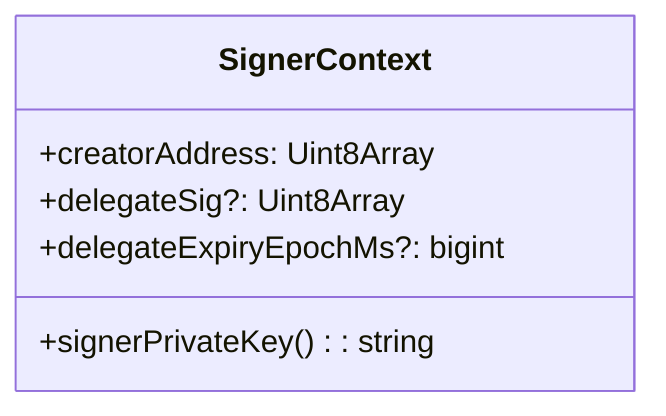
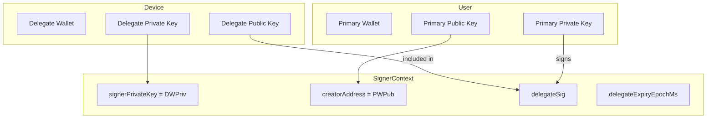
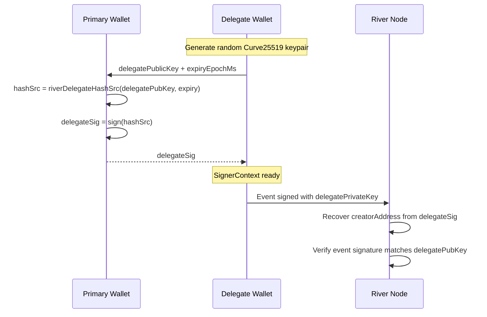
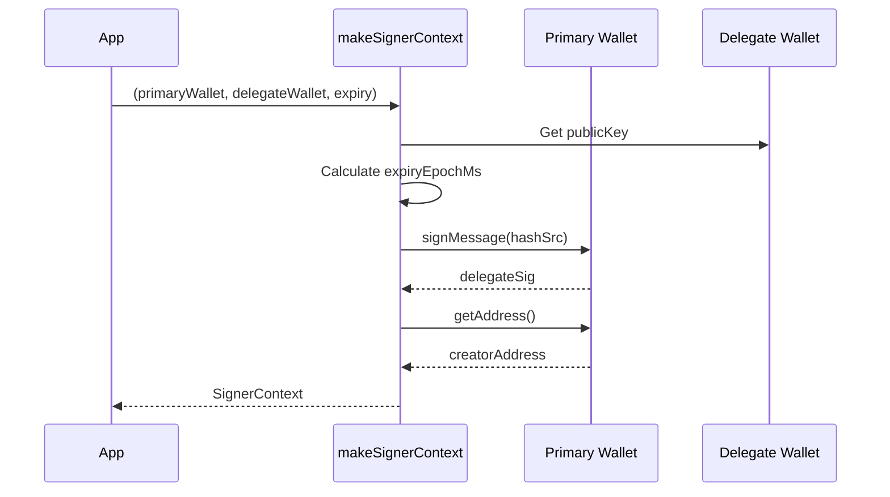
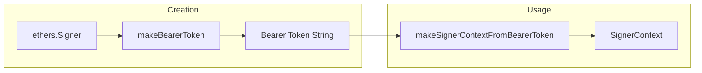
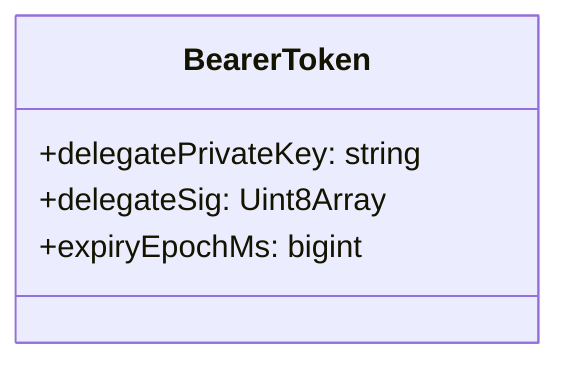
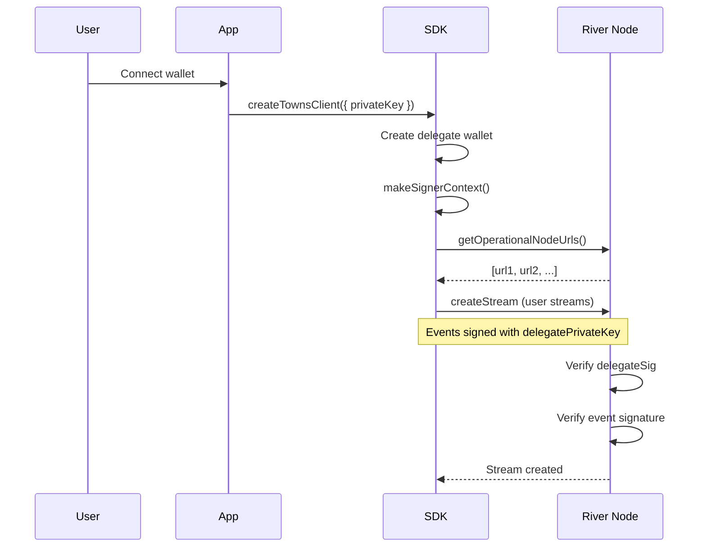
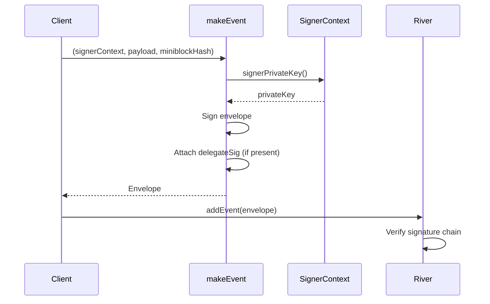
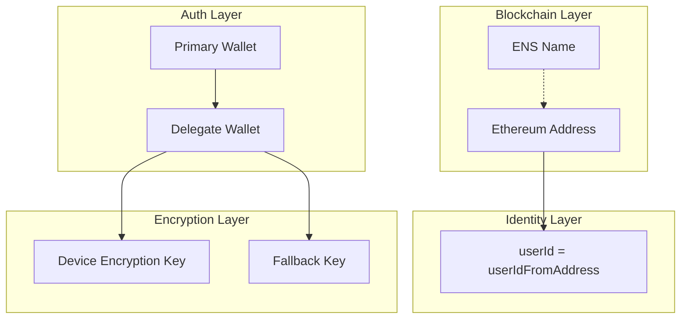

# Authentication Layer

The Authentication layer manages wallet delegation, signing contexts, and bearer tokens for authenticating with River nodes.

## SignerContext

`SignerContext` is the core authentication primitive that holds credentials for signing events.

### Interface



| Field | Description |
|-------|-------------|
| `signerPrivateKey` | Function returning the private key used to sign events |
| `creatorAddress` | The user's Ethereum address (derived from primary wallet) |
| `delegateSig` | Signature from primary wallet authorizing the delegate |
| `delegateExpiryEpochMs` | When the delegation expires |

## Delegation Model

Towns uses a **key delegation** model where:
1. **Primary Wallet** - The user's main Ethereum wallet (MetaMask, hardware wallet, etc.)
2. **Delegate Wallet** - A temporary device-specific key that signs events on behalf of the user



### Delegation Signature

The delegate signature proves the primary wallet authorized the delegate:



## Creating SignerContext

### From Wallet (Interactive)

```typescript
import { makeSignerContext } from '@towns-protocol/sdk'
import { ethers } from 'ethers'

const primaryWallet = new ethers.Wallet(privateKey)
const delegateWallet = ethers.Wallet.createRandom()

const signerContext = await makeSignerContext(
    primaryWallet,
    delegateWallet,
    { days: 7 }  // expiry
)
```



### From Bearer Token (Non-Interactive)

Bearer tokens allow authentication without user interaction:

```typescript
import { makeBearerToken, makeSignerContextFromBearerToken } from '@towns-protocol/sdk'

// Create token (one-time, requires wallet)
const token = await makeBearerToken(signer, { days: 30 })

// Later: restore context from token
const signerContext = await makeSignerContextFromBearerToken(token)
```



### Bearer Token Structure



The bearer token is serialized as a hex-encoded protobuf message containing all the information needed to recreate the SignerContext.

## Authentication Flow

### Initial Setup



### Event Signing

Every event sent to River nodes is signed using the SignerContext:



## Key Hierarchy



## Expiry Handling

Delegation can expire. The SDK supports flexible expiry configuration:

```typescript
// Specific duration
await makeSignerContext(primary, delegate, { days: 7 })
await makeSignerContext(primary, delegate, { hours: 24 })
await makeSignerContext(primary, delegate, { minutes: 30 })

// Absolute timestamp
await makeSignerContext(primary, delegate, 1735689600000n)

// No expiry (legacy, not recommended)
await makeSignerContext(primary, delegate, 0n)
```

## Security Considerations

1. **Primary Key Protection** - The primary key only signs the delegation; it's never sent to River nodes
2. **Delegate Rotation** - Generate new delegates regularly; don't reuse across devices
3. **Bearer Token Storage** - Store bearer tokens securely; they grant full access
4. **Expiry** - Set reasonable expiry times; don't use infinite delegations in production

## Source Files

| File | Description |
|------|-------------|
| `src/signerContext.ts` | SignerContext interface and factory functions |
| `src/sign.ts` | Event signing and envelope creation |
| `@towns-protocol/utils` | Delegate signature utilities |
