# RPC Layer

The RPC layer handles communication with River nodes using gRPC-Web over HTTP/2.

## StreamRpcClient

`StreamRpcClient` is the typed RPC client for communicating with River's StreamService.

### Class Structure

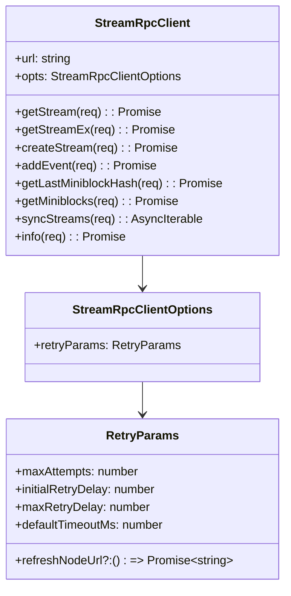

## Client Creation

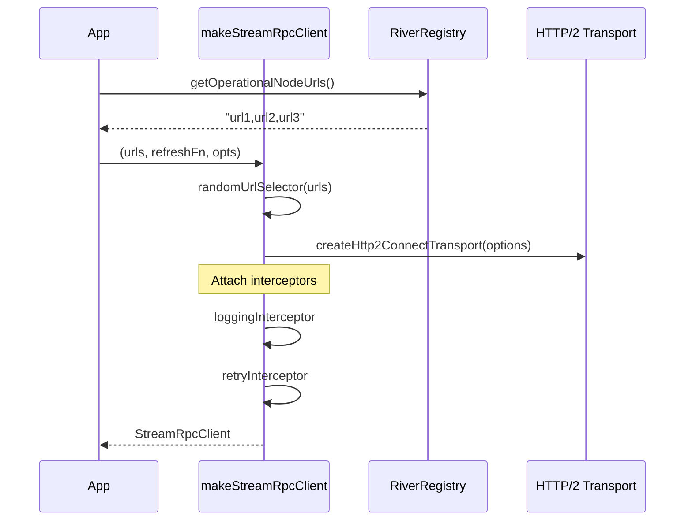

## Interceptor Chain

Requests pass through interceptors before reaching the network:

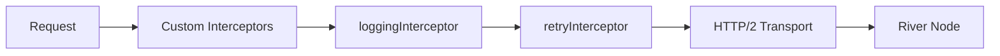

### loggingInterceptor

Adds request tracking and metrics:

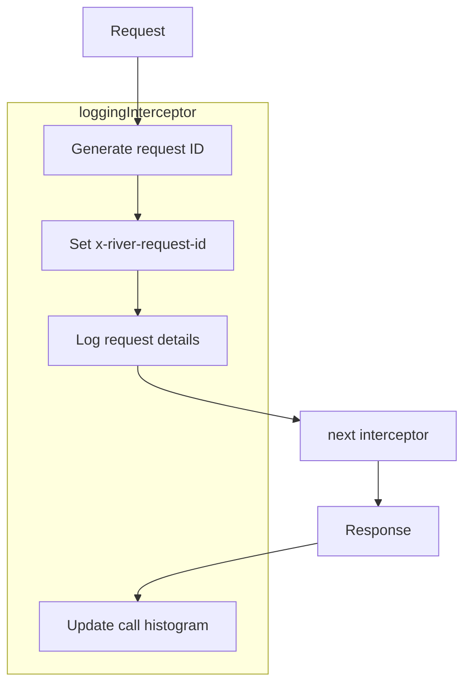

### retryInterceptor

Handles transient failures with automatic retry:

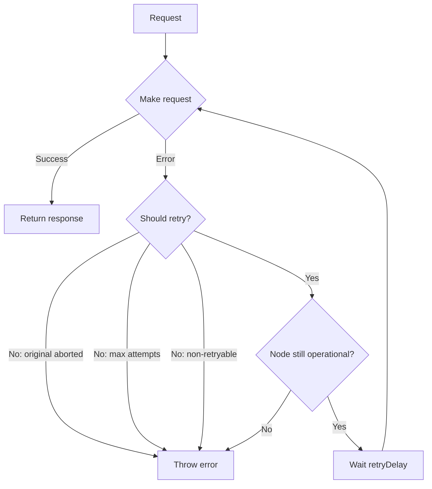

### Default Retry Parameters

```typescript
const DEFAULT_RETRY_PARAMS = {
    maxAttempts: 3,
    initialRetryDelay: 2000,   // 2 seconds
    maxRetryDelay: 6000,       // 6 seconds
    defaultTimeoutMs: 90000,   // 90 seconds
}
```

### Retry Delay Calculation

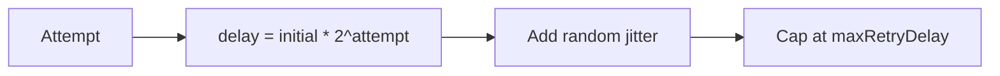

## Node Selection

When multiple nodes are available, the client selects randomly:

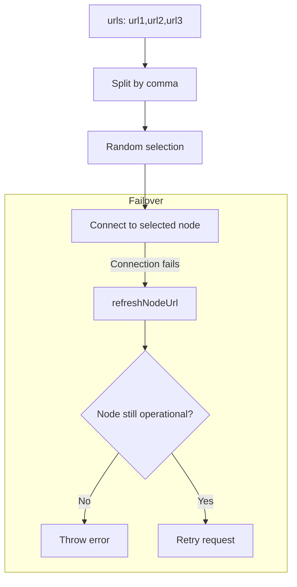

## Request/Response Flow

### Unary Requests (getStream, addEvent, etc.)

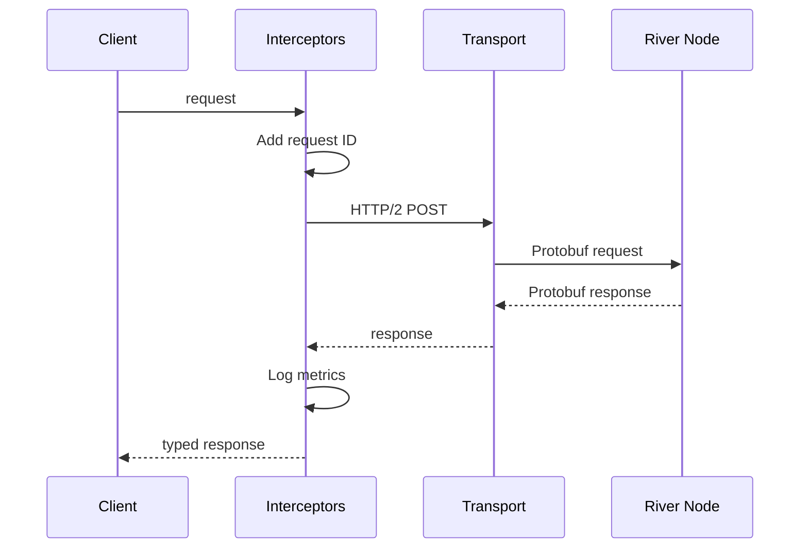

### Streaming Requests (syncStreams)

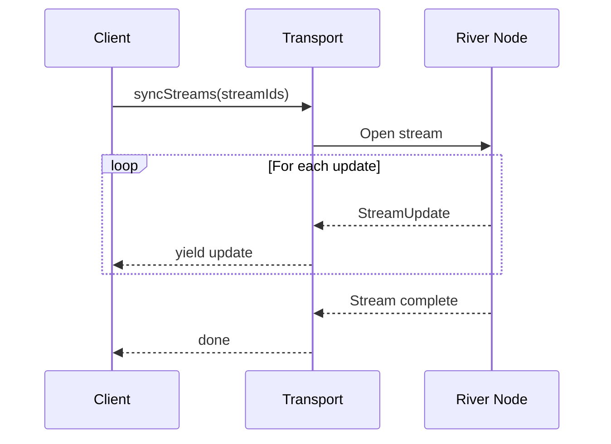

## Key RPC Methods

| Method | Purpose | Response |
|--------|---------|----------|
| `getStream` | Fetch stream state | Snapshot + recent miniblocks |
| `getStreamEx` | Fetch with creation cookie | Same + creation info |
| `createStream` | Create new stream | Creation confirmation |
| `addEvent` | Add event to stream | Event confirmation |
| `getLastMiniblockHash` | Get latest miniblock | Hash + number |
| `getMiniblocks` | Fetch miniblock range | Miniblocks + snapshots |
| `syncStreams` | Real-time sync | Stream of updates |
| `info` | Node information | Node metadata |

## getMiniblocks Pagination

Large miniblock ranges are fetched in chunks:

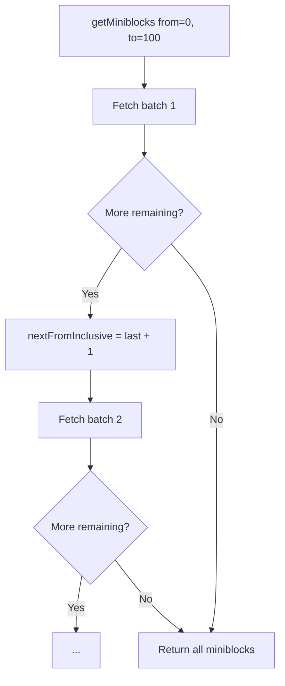

## Error Handling

### Retryable Errors

| Error | Behavior |
|-------|----------|
| Connection timeout | Retry with delay |
| Network failure | Retry with delay |
| Node temporarily unavailable | Retry with delay |

### Non-Retryable Errors

| Error | Behavior |
|-------|----------|
| `PERMISSION_DENIED` | Throw immediately |
| `NOT_FOUND` | Throw immediately |
| Request aborted | Throw immediately |
| Node no longer operational | Throw immediately |

## Configuration

### Transport Options

```typescript
const options: ConnectTransportOptions = {
    baseUrl: selectedUrl,
    interceptors: [...],
    defaultTimeoutMs: undefined,  // Handled by retryInterceptor
    useBinaryFormat: true,        // Protobuf binary
}
```

### Debug Mode

Set `RIVER_DEBUG_TRANSPORT=true` to use JSON format for debugging:

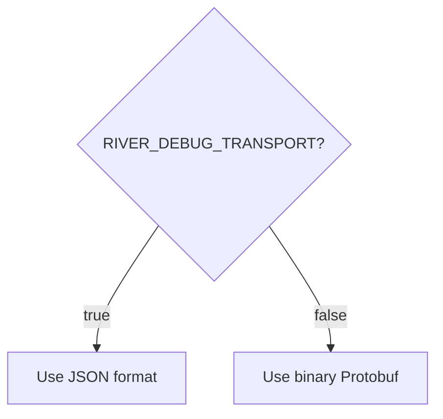

## Source Files

| File | Description |
|------|-------------|
| `src/makeStreamRpcClient.ts` | Client factory and getMiniblocks helper |
| `src/rpcInterceptors.ts` | All interceptor implementations |
| `src/rpcCommon.ts` | Common RPC types |
| `@towns-protocol/proto` | StreamService protobuf definition |
