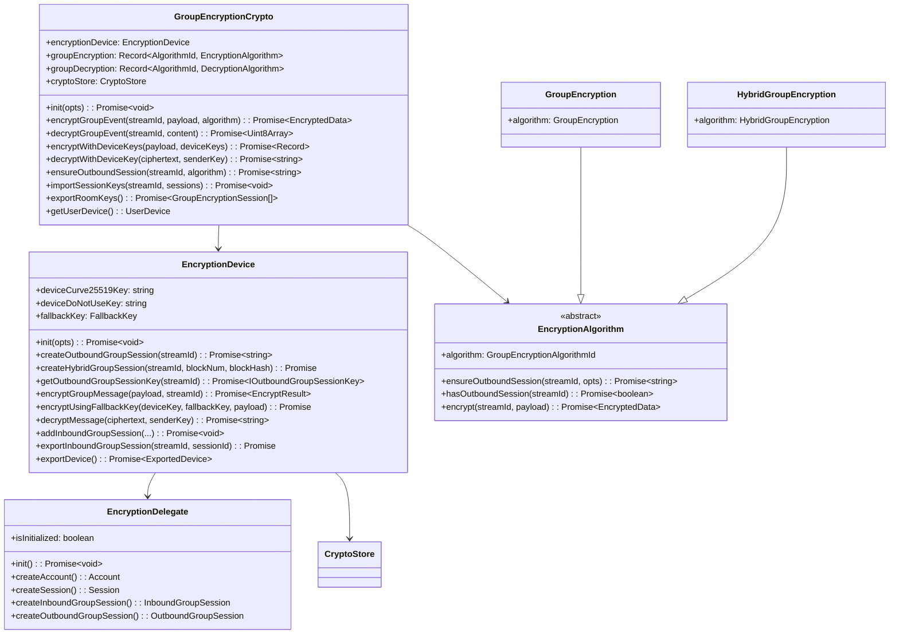
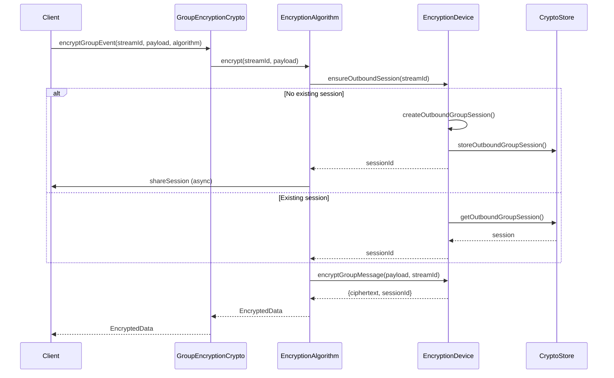
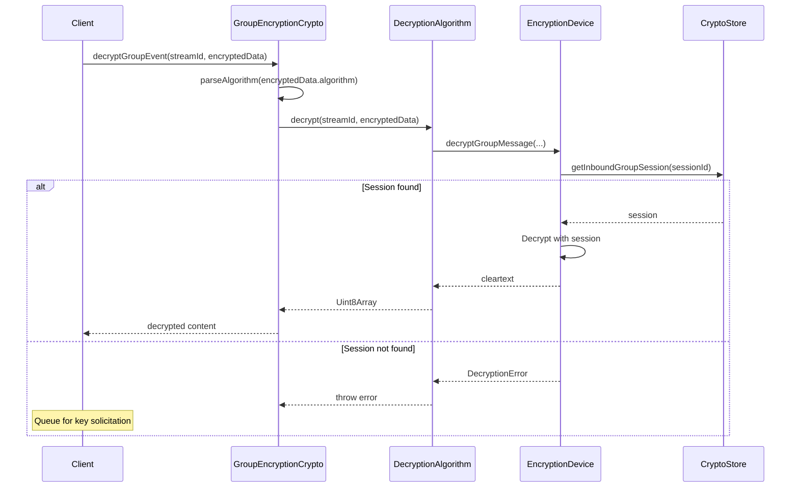
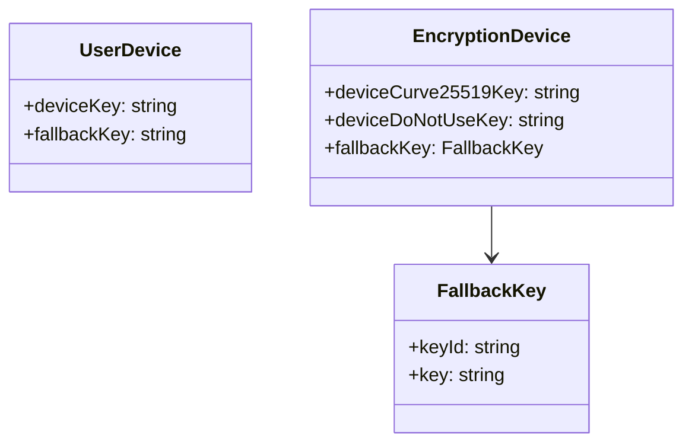
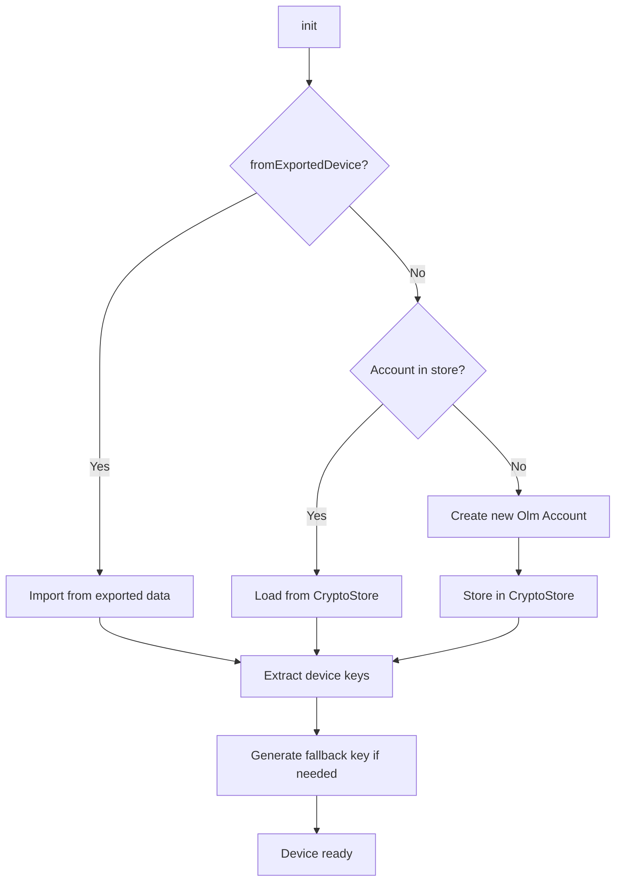
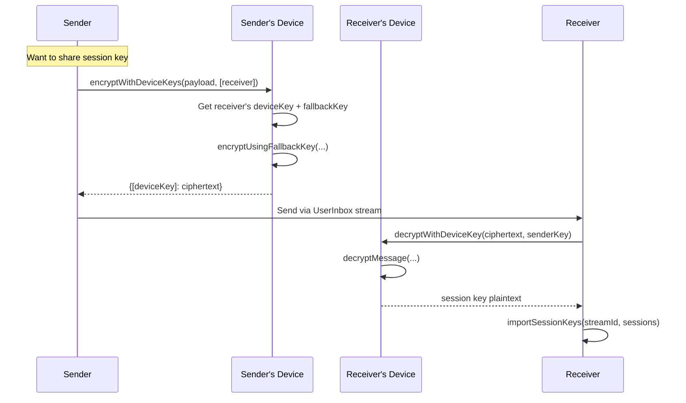
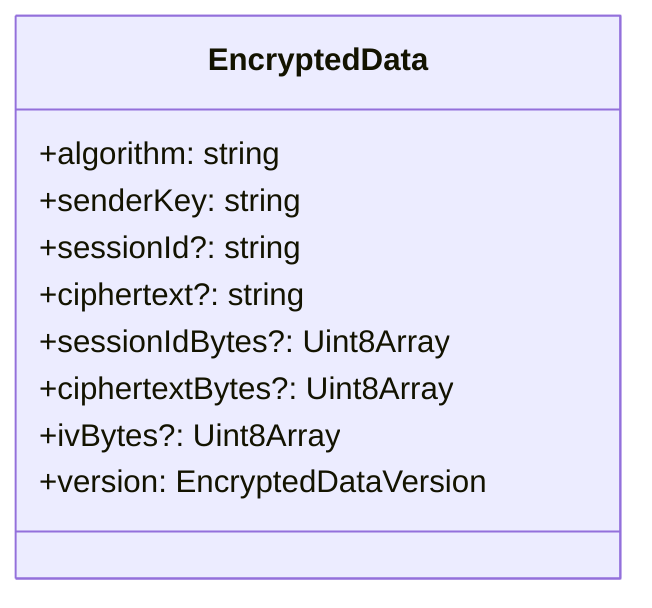
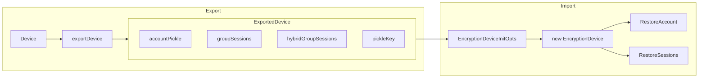

# Encryption Layer

The Encryption layer provides end-to-end encryption for all message content in Towns Protocol.

## Architecture Overview

## Encryption Algorithms

Towns supports two encryption algorithms:

| Algorithm | ID | Description |
|-----------|-----|-------------|
| **GroupEncryption** | `r.group-encryption.v1.aes-sha2` | Megolm-based (Signal protocol) |
| **HybridGroupEncryption** | `grpaes` | AES-GCM-256 with Olm key distribution |

### GroupEncryption (Megolm)

Uses the Olm library's Megolm implementation (Signal protocol):

```mermaid
flowchart TD
    subgraph Setup
        Create[Create OutboundGroupSession]
        Create --> Ratchet[Initialize ratchet state]
        Ratchet --> Share[Share session key to members]
    end

    subgraph Encrypt
        Plain[Plaintext] --> Encode[Base64 encode]
        Encode --> MegolmEnc[Megolm encrypt]
        MegolmEnc --> Advance[Advance ratchet]
        Advance --> Cipher[Ciphertext + sessionId]
    end

    subgraph Decrypt
        CipherIn[Ciphertext] --> LoadSession[Load InboundGroupSession]
        LoadSession --> MegolmDec[Megolm decrypt]
        MegolmDec --> Decode[Base64 decode]
        Decode --> PlainOut[Plaintext]
    end
```

### HybridGroupEncryption (AES-GCM)

Uses symmetric AES-GCM-256 encryption with Olm for key distribution:

```mermaid
flowchart TD
    subgraph Setup
        GenKey[Generate AES-GCM-256 key]
        GenKey --> StoreKey[Store in CryptoStore]
        StoreKey --> ShareKey[Encrypt key to members using Olm]
    end

    subgraph Encrypt
        Plain[Plaintext bytes] --> GenIV[Generate 12-byte IV]
        GenIV --> AESEnc[AES-GCM encrypt]
        AESEnc --> Output[ciphertext + IV + sessionId]
    end

    subgraph Decrypt
        CipherIn[Ciphertext + IV] --> LoadKey[Load AES key from store]
        LoadKey --> AESDec[AES-GCM decrypt]
        AESDec --> PlainOut[Plaintext bytes]
    end
```

## Message Encryption Flow

## Message Decryption Flow

## Device Key Management

Each device has its own encryption identity:

### Device Initialization

## Device-to-Device Encryption

For sharing session keys between devices:

## EncryptedData Structure

| Field | GroupEncryption | HybridGroupEncryption |
|-------|-----------------|----------------------|
| `algorithm` | `r.group-encryption.v1.aes-sha2` | `grpaes` |
| `senderKey` | Device Curve25519 key | Device Curve25519 key |
| `sessionId` | Megolm session ID (string) | - |
| `ciphertext` | Base64 Megolm ciphertext | - |
| `sessionIdBytes` | - | AES session ID (bytes) |
| `ciphertextBytes` | - | AES-GCM ciphertext |
| `ivBytes` | - | 12-byte IV |
| `version` | 0 (legacy) or 1 (binary) | 0 (legacy) or 1 (binary) |

## Export/Import Device

Devices can be exported and restored:

## Security Properties

1. **Forward Secrecy** - Megolm provides limited forward secrecy through ratcheting
2. **Post-Compromise Recovery** - New sessions created after key compromise are secure
3. **Deniability** - Messages can't be cryptographically proven to come from a specific user
4. **End-to-End** - Server never sees plaintext content

## Source Files

| File | Description |
|------|-------------|
| `packages/encryption/src/groupEncryptionCrypto.ts` | Main orchestrator class |
| `packages/encryption/src/encryptionDevice.ts` | Device key and session management |
| `packages/encryption/src/encryptionDelegate.ts` | Olm library wrapper |
| `packages/encryption/src/groupEncryption.ts` | Megolm encryption algorithm |
| `packages/encryption/src/hybridGroupEncryption.ts` | AES-GCM hybrid algorithm |
| `packages/encryption/src/groupDecryption.ts` | Megolm decryption |
| `packages/encryption/src/hybridGroupDecryption.ts` | AES-GCM hybrid decryption |
| `packages/encryption/src/cryptoAesGcm.ts` | Web Crypto API AES-GCM utilities |
| `packages/encryption/src/olmLib.ts` | Algorithm IDs and session types |
