# Crypto Store Layer

The Crypto Store layer provides persistent storage for cryptographic keys and session data.

## CryptoStore Interface

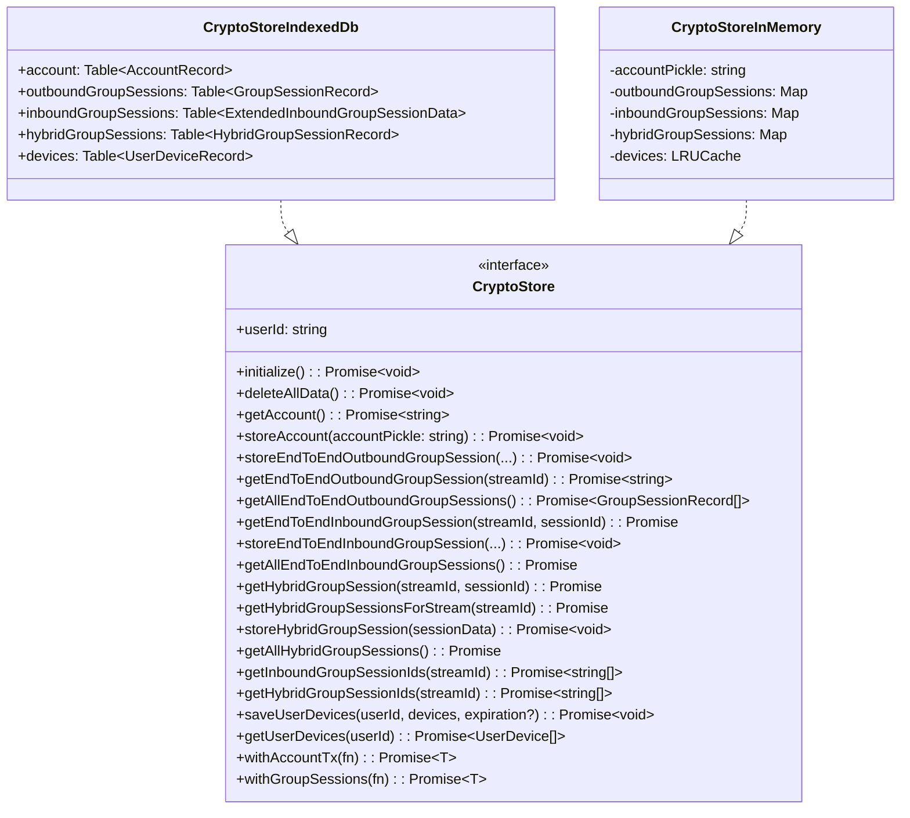

## Implementation Selection

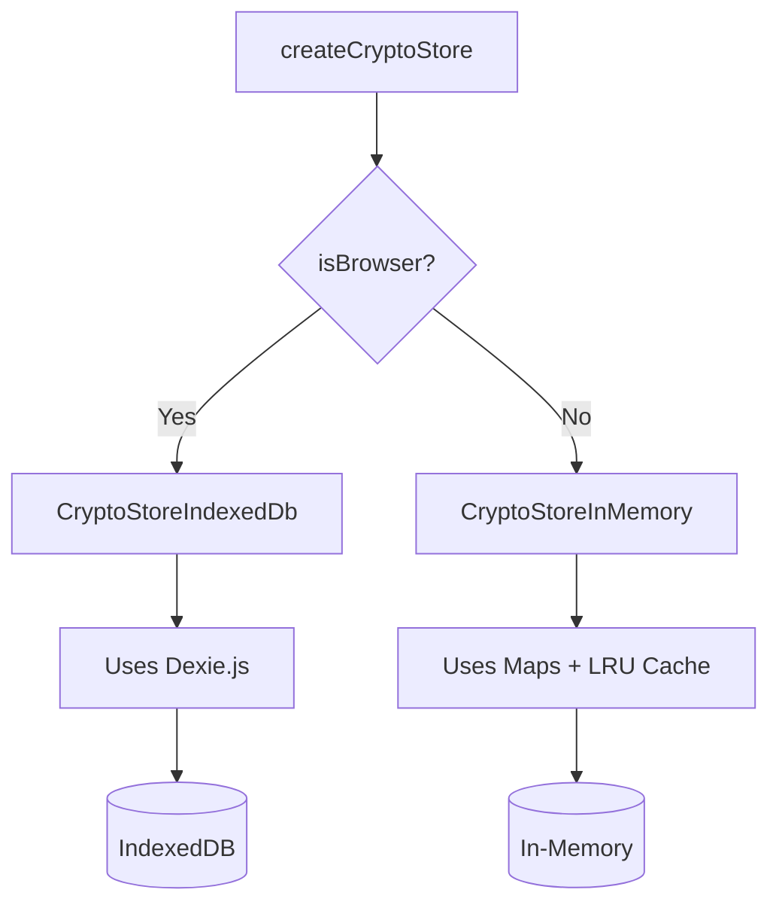

## Data Schema

### Account Record

Stores the pickled Olm account (device identity):

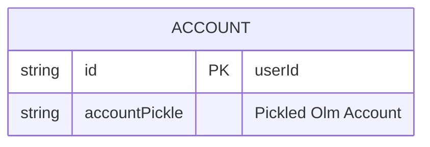

### Group Session Records

Stores Megolm session data:

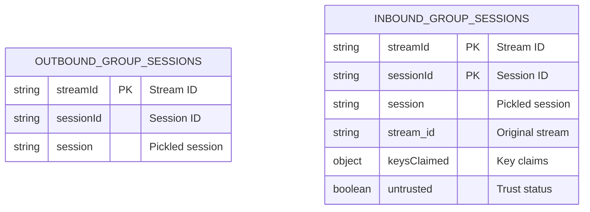

### Hybrid Group Session Records

Stores AES-GCM session keys:

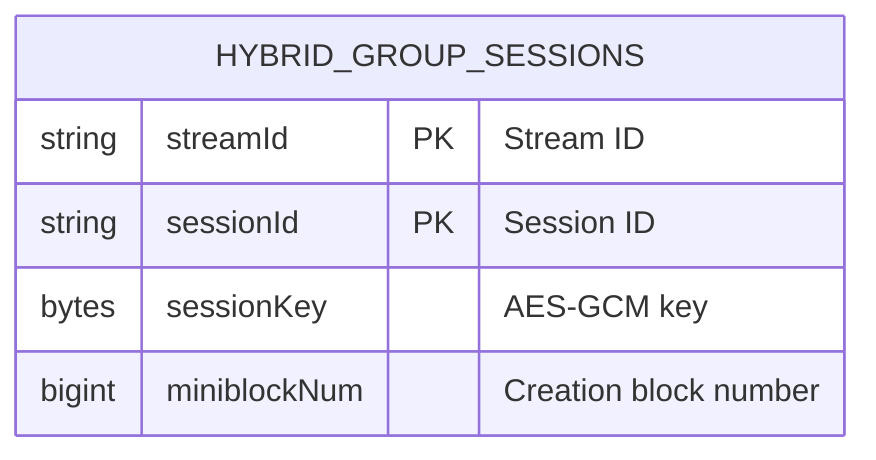

### User Device Records

Caches other users' device keys:

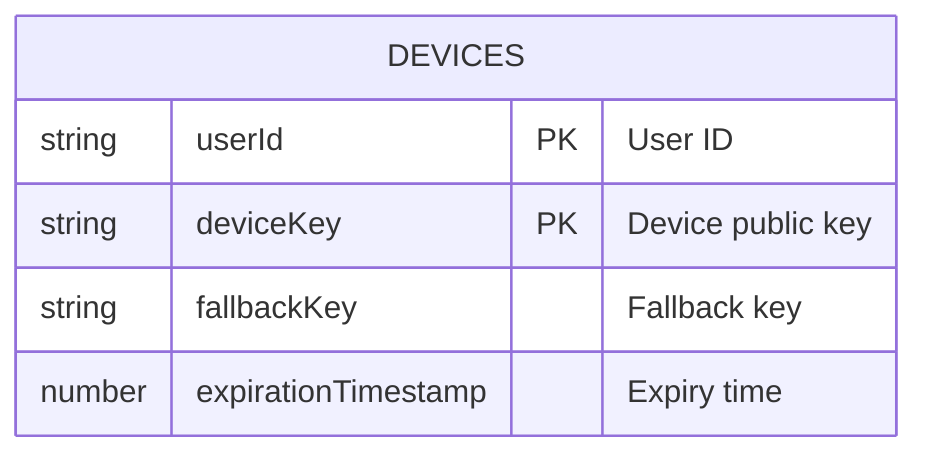

## IndexedDB Schema (Dexie)

```typescript
this.version(6).stores({
    account: 'id',                              // Primary key: id
    inboundGroupSessions: '[streamId+sessionId]', // Compound key
    outboundGroupSessions: 'streamId',          // Primary key: streamId
    hybridGroupSessions: '[streamId+sessionId],streamId', // Compound + index
    devices: '[userId+deviceKey],expirationTimestamp',    // Compound + index
})
```

## Storage Operations

### Account Management

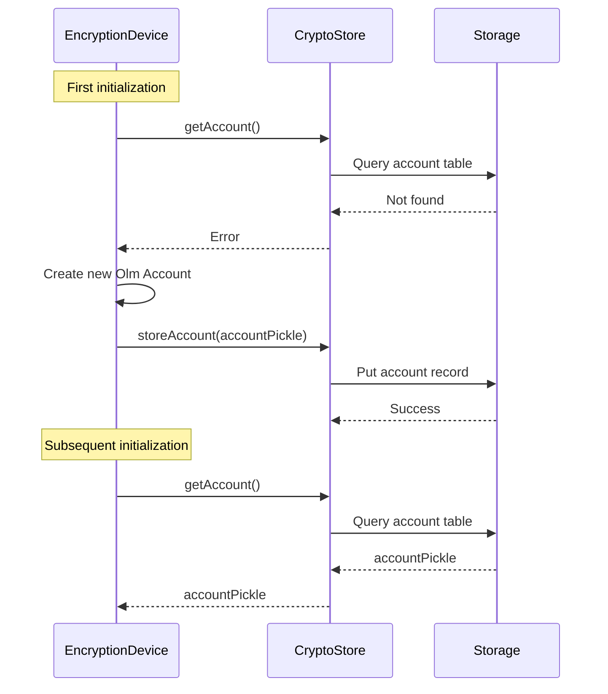

### Session Storage

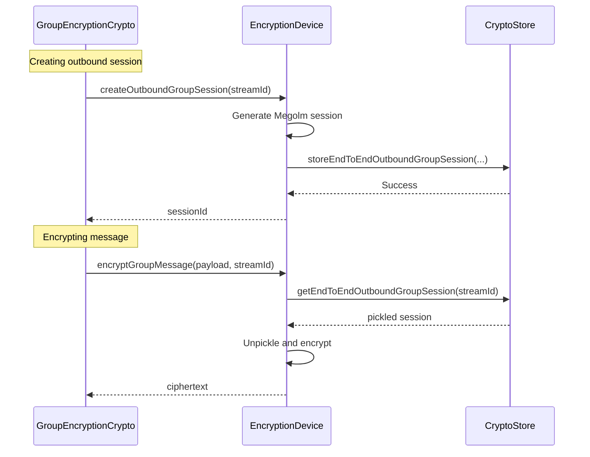

### Device Key Caching

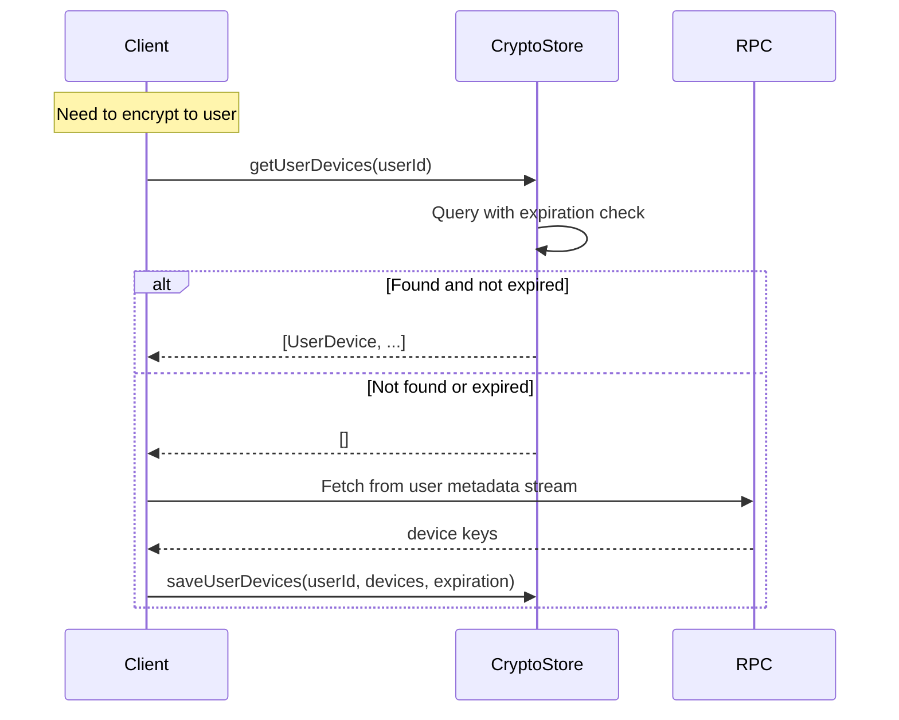

## CryptoStoreInMemory

For Node.js environments, uses in-memory storage with LRU caching:

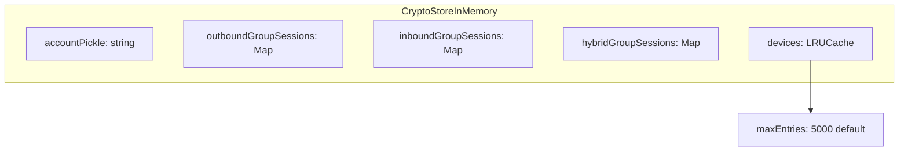

### LRU Eviction

To prevent unbounded memory growth in long-running bots:

```typescript
const maxEntries = opts?.maxCryptoStoreEntries ?? 5000

// LRU cache automatically evicts oldest entries
// when maxEntries is exceeded
```

## Transaction Support

Both implementations support transactions for atomic operations:

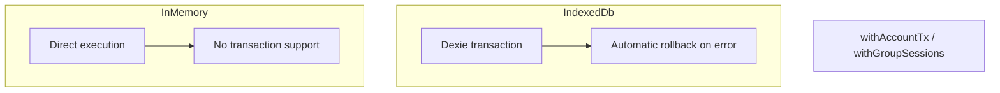

## Device Expiration

User device keys expire after 5 days by default:

```typescript
const DEFAULT_USER_DEVICE_EXPIRATION_TIME_MS = 5 * ONE_DAY_MS
```

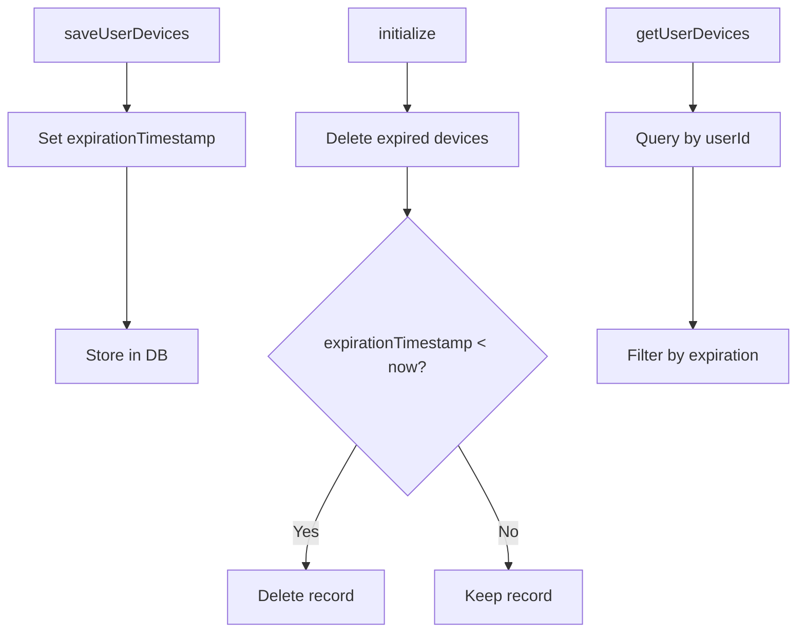

## Error Handling

| Operation | Error Condition | Behavior |
|-----------|-----------------|----------|
| `getAccount()` | Account not found | Throw error |
| `getEndToEndOutboundGroupSession()` | Session not found | Throw error |
| `getEndToEndInboundGroupSession()` | Session not found | Return undefined |
| `getHybridGroupSession()` | Session not found | Return undefined |
| `getUserDevices()` | Devices expired | Return empty array |

## Source Files

| File | Description |
|------|-------------|
| `packages/encryption/src/cryptoStore.ts` | Interface definition and factory |
| `packages/encryption/src/CryptoStoreIndexedDb.ts` | Browser implementation |
| `packages/encryption/src/CryptoStoreInMemory.ts` | Node.js implementation |
| `packages/encryption/src/storeTypes.ts` | Record type definitions |
