# Stream Layer

The Stream layer manages the state of individual streams, processing events and maintaining views of stream content.

## Stream Hierarchy

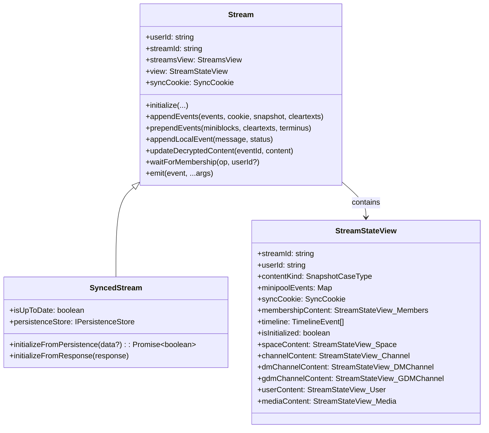

## Stream Types

Streams are identified by their ID prefix:

| Type | ID Prefix | Content Type | Description |
|------|-----------|--------------|-------------|
| **Space** | `10*` | `spaceContent` | Top-level community |
| **Channel** | `20*` | `channelContent` | Public channel in a space |
| **DM** | `77*` | `dmChannelContent` | Direct message (1:1) |
| **GDM** | `88*` | `gdmChannelContent` | Group direct message |
| **User** | `a1*` | `userContent` | User's stream memberships |
| **UserSettings** | `a2*` | `userSettingsContent` | User preferences |
| **UserMetadata** | `a3*` | `userMetadataContent` | Device keys |
| **UserInbox** | `a4*` | `userInboxContent` | Key exchange inbox |
| **Media** | `ff*` | `mediaContent` | Media storage |

## StreamStateView

`StreamStateView` is the core state container for a stream.

### Content Type Polymorphism

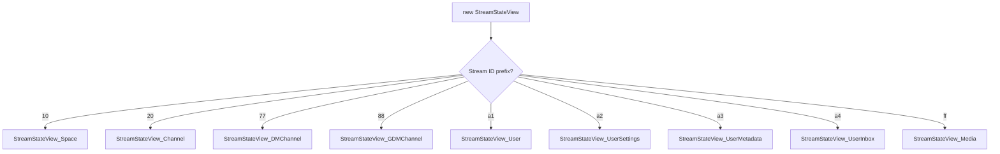

### Key Properties

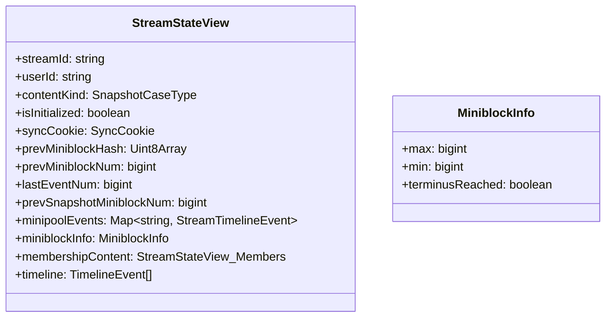

## Stream Lifecycle

### Initialization

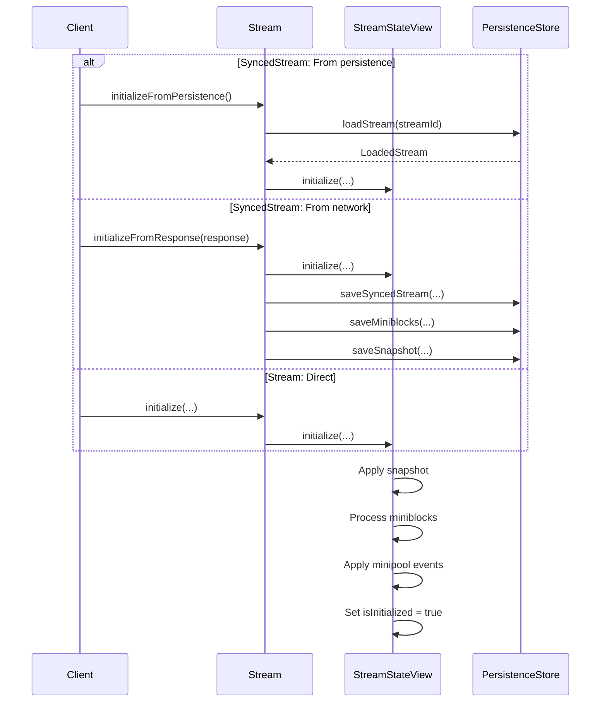

### Event Processing

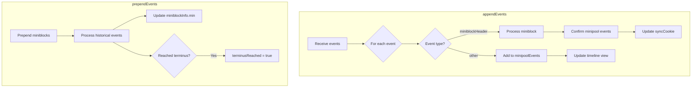

### Event States

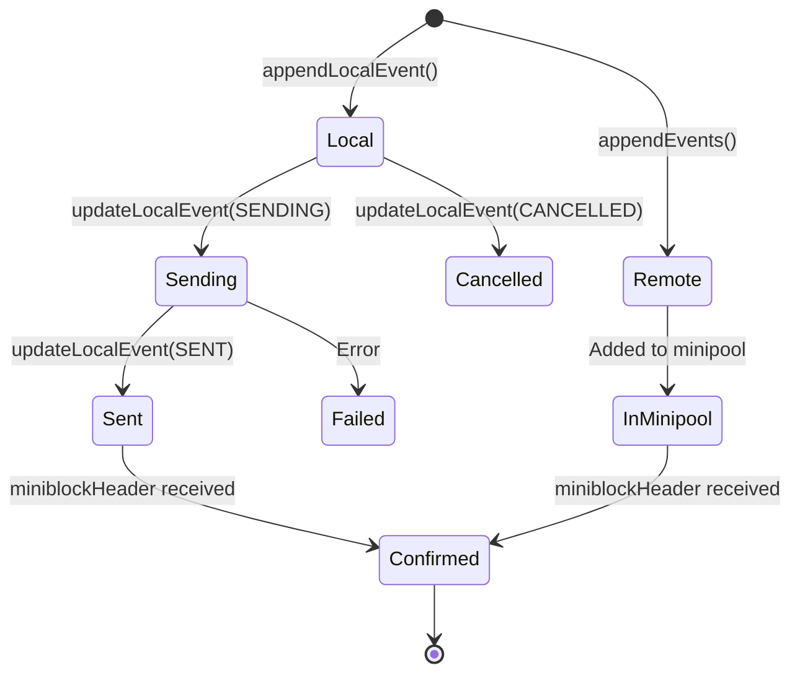

## Minipool and Miniblocks

Events go through two stages:

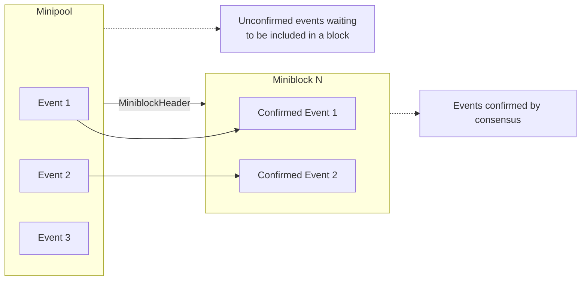

## Content Type Views

Each content type has its own view class:

### StreamStateView_Channel

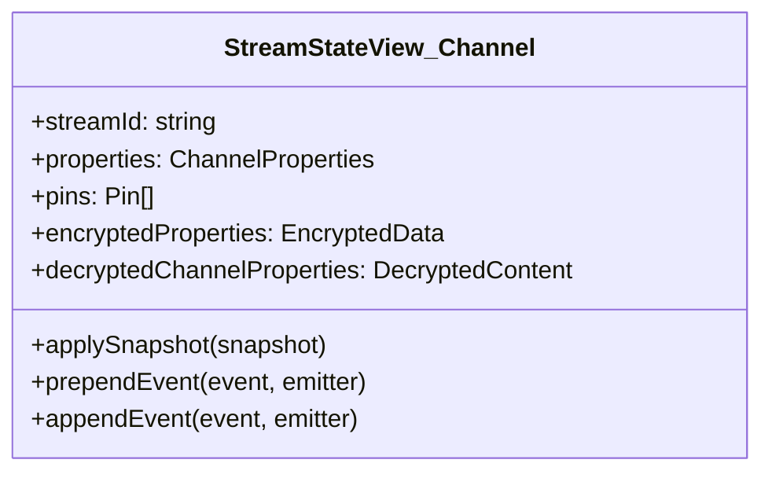

### StreamStateView_Members

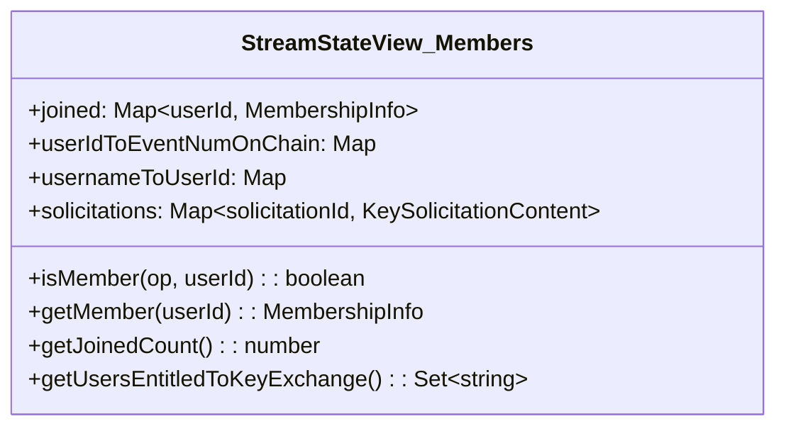

## Timeline Integration

StreamStateView connects to TimelinesView for reactive updates:

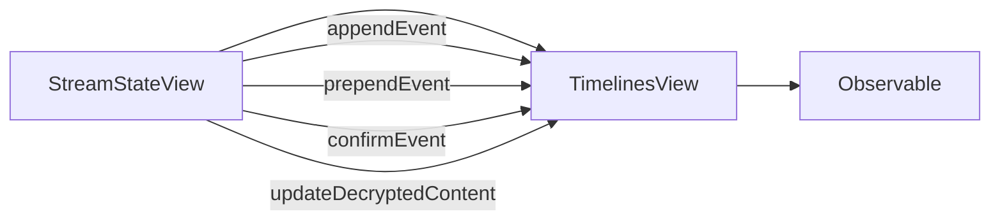

## SyncedStream

`SyncedStream` extends `Stream` with persistence capabilities:

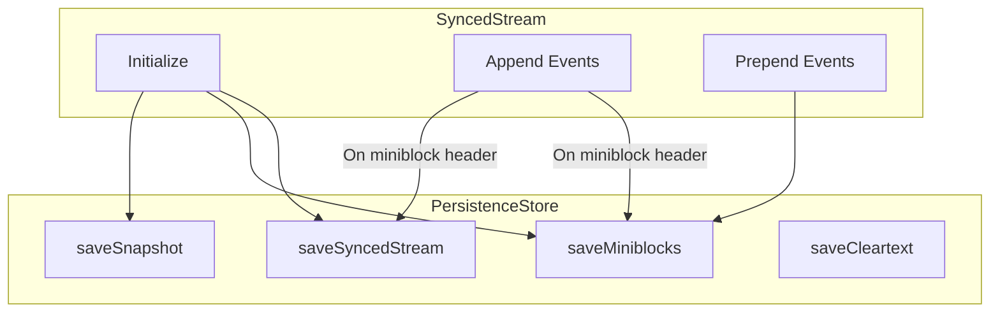

## Stream Events

Streams emit events for state changes:

| Event | When | Payload |
|-------|------|---------|
| `streamNewUserJoined` | User joins | userId, streamId |
| `streamUserLeft` | User leaves | userId, streamId |
| `streamMembershipUpdated` | Membership changes | streamId |
| `streamInitialized` | Stream ready | streamId |
| `streamUpToDate` | Sync complete | streamId |
| `streamNewMessage` | New message | event |
| `streamEncryptedContentAdded` | Encrypted content | eventId, streamId |

## Source Files

| File | Description |
|------|-------------|
| `src/stream.ts` | Base Stream class |
| `src/syncedStream.ts` | Persisted SyncedStream |
| `src/streamStateView.ts` | Core state container |
| `src/streamStateView_*.ts` | Content type implementations |
| `src/syncedStreams.ts` | Stream collection manager |
| `src/streamEvents.ts` | Event type definitions |
