# Timeline and Views Layer

The Timeline and Views layer provides reactive, observable state for UI consumption.

## Architecture Overview

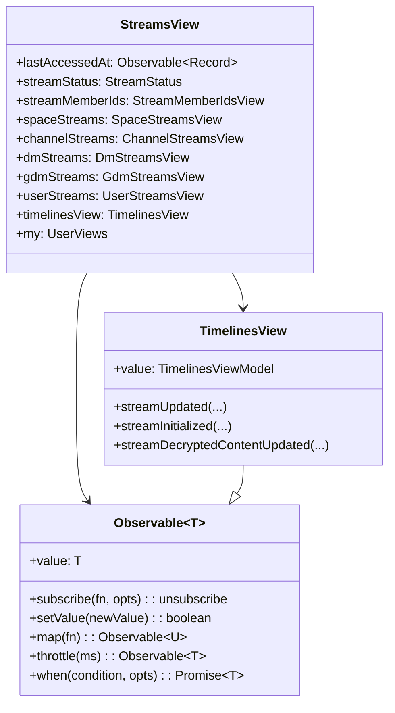

## Observable Pattern

The SDK uses a custom Observable implementation for reactive state:

### Observable Class

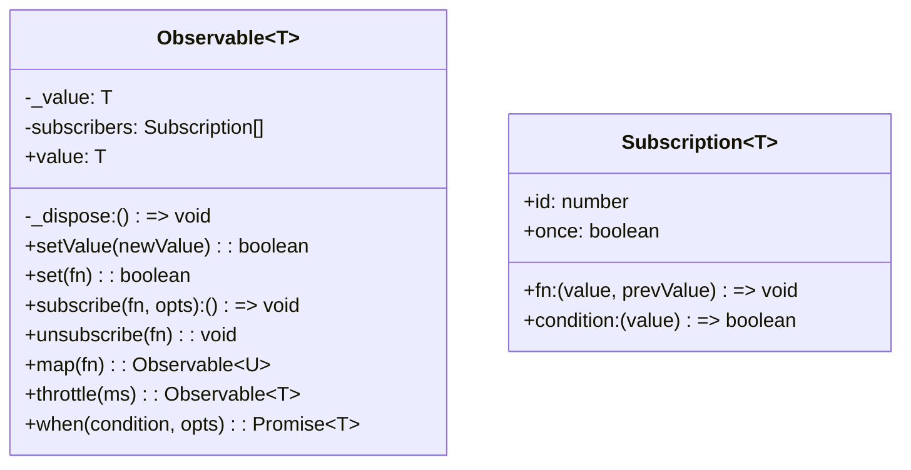

### Subscribe Options

```typescript
observable.subscribe(
    (newValue, prevValue) => { /* handler */ },
    {
        fireImediately?: boolean,  // Call immediately with current value
        once?: boolean,            // Auto-unsubscribe after first call
        condition?: (value) => boolean  // Only fire when condition is true
    }
)
```

### Transforms

```mermaid
flowchart LR
    subgraph "Observable Transforms"
        Source[Observable A] --> Map[".map(fn)"]
        Map --> Mapped[Observable B]

        Source2[Observable A] --> Throttle[".throttle(ms)"]
        Throttle --> Throttled[Observable A (throttled)]

        Source3[Observable A] --> When[".when(condition)"]
        When --> Promise[Promise A]
    end
```

## StreamsView

`StreamsView` aggregates all stream-related observables:

### Structure

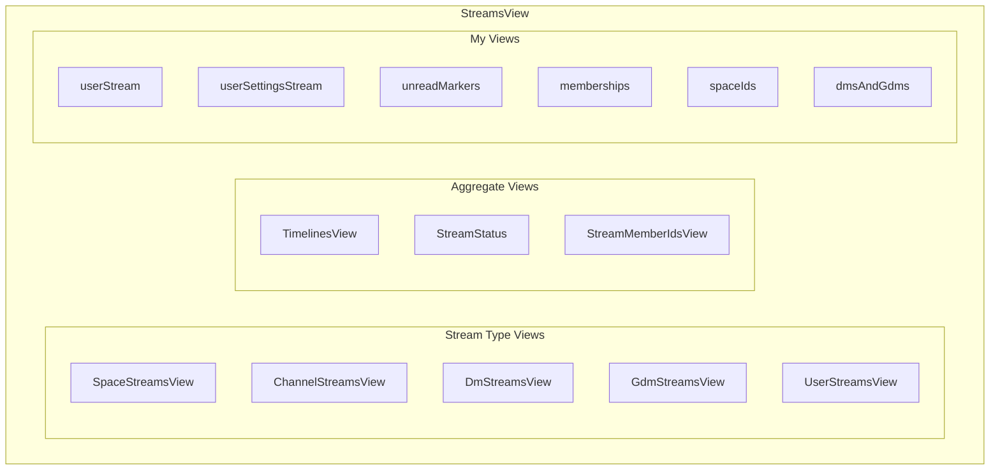

### User Views (`my`)

Convenient access to current user's data:

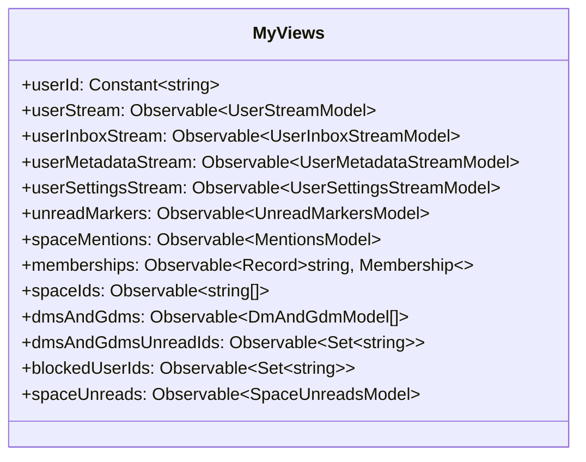

## TimelinesView

`TimelinesView` manages the timeline state for all streams:

### TimelinesViewModel

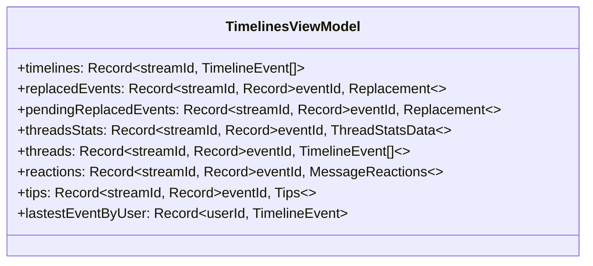

### TimelineEvent

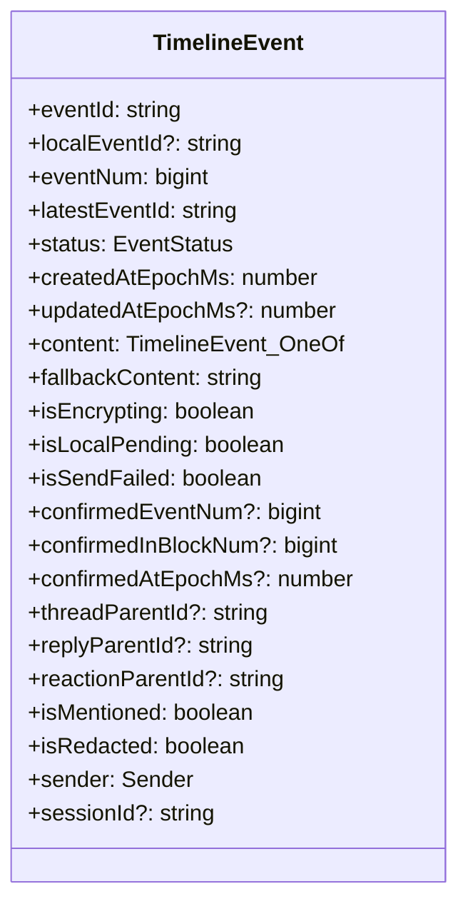

### Event Status

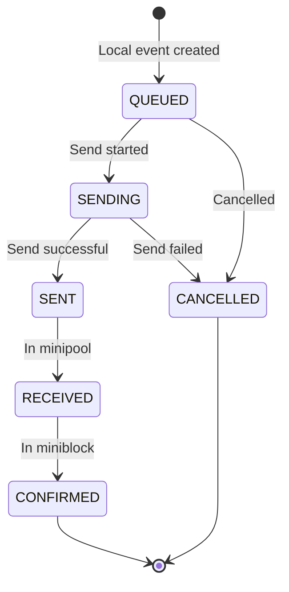

## Data Flow

### From Stream to Observable

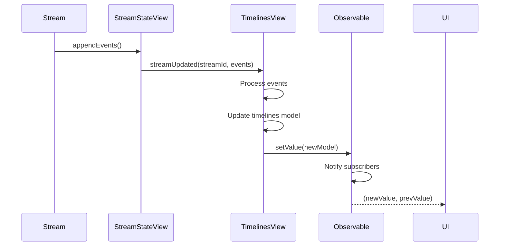

### Transform Pipeline

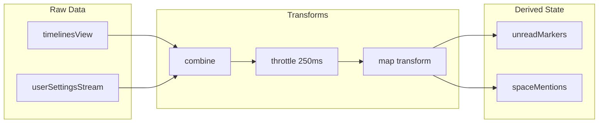

## Transform Functions

The SDK includes many transform functions for derived state:

| Transform | Input | Output |
|-----------|-------|--------|
| `unreadMarkersTransform` | timelines + fullyReadMarkers | UnreadMarkersModel |
| `spaceMentionsTransform` | timelines + unreadMarkers | MentionsModel |
| `membershipsTransform` | userStream | Record<streamId, Membership> |
| `spaceIdsTransform` | memberships | string[] |
| `dmsAndGdmsTransform` | memberships + streams | DmAndGdmModel[] |
| `blockedUserIdsTransform` | userSettings | Set<string> |
| `spaceUnreadsTransform` | spaces + unread | SpaceUnreadsModel |

## Combine Observable

Combines multiple observables into one:

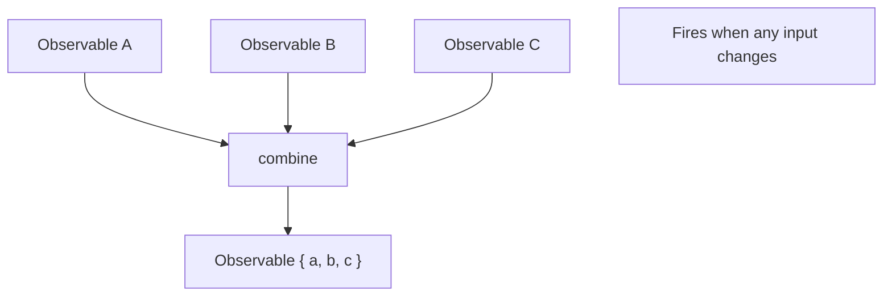

```typescript
const combined = combine({
    userId: myUserId,
    timelinesView: timelinesView,
    fullyReadMarkers: fullyReadMarkers,
})
```

## Throttling

Prevents excessive updates to downstream subscribers:

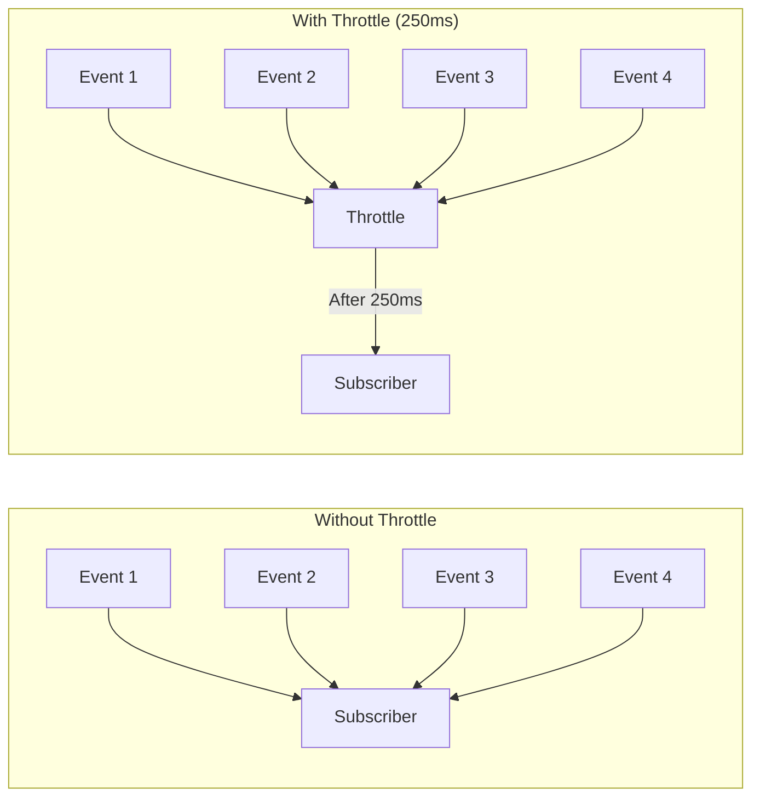

## Typical Usage

```typescript
// Subscribe to unread markers
const unsubscribe = client.streamsView.my.unreadMarkers.subscribe(
    (unreadMarkers, prevMarkers) => {
        // Update UI with new unread state
        updateBadgeCounts(unreadMarkers)
    },
    { fireImediately: true }
)

// Wait for a condition
await client.streamsView.my.memberships.when(
    (memberships) => memberships[spaceId]?.isMember === true,
    { timeoutMs: 10000 }
)

// Map to derived value
const channelNames = client.streamsView.channelStreams.map(
    (channels) => Object.values(channels).map(c => c.name)
)
```

## Source Files

| File | Description |
|------|-------------|
| `src/views/streamsView.ts` | Main StreamsView aggregator |
| `src/views/streams/timelines.ts` | TimelinesView implementation |
| `src/views/streams/timelinesModel.ts` | Timeline state machine |
| `src/views/models/timelineTypes.ts` | TimelineEvent and related types |
| `src/observable/observable.ts` | Observable base class |
| `src/observable/combine.ts` | Combine utility |
| `src/observable/constant.ts` | Constant observable |
| `src/views/transforms/*.ts` | Transform functions |
