# Persistence Layer

The Persistence layer provides offline-capable storage for stream data, enabling fast startup and reduced network usage.

## PersistenceStore Interface


## Database Schema (IndexedDB via Dexie)


### Dexie Schema Definition

```typescript
this.version(9).stores({
    cleartexts: 'eventId',                    // Primary key
    syncedStreams: 'streamId',                // Primary key
    miniblocks: '[streamId+miniblockNum]',    // Compound key
    snapshots: 'streamId',                    // Primary key
    scratch: 'id',                            // Primary key
})
```

## Data Structures

### PersistedSyncedStream

Stores stream sync state:


### LoadedStream

Result of loading a complete stream from persistence:


## Load Stream Flow

```mermaid
sequenceDiagram
    participant Client
    participant Store as PersistenceStore
    participant IDB as IndexedDB

    Client->>Store: loadStream(streamId)

    Store->>IDB: getSyncedStream(streamId)
    IDB-->>Store: PersistedSyncedStream

    alt Not found
        Store-->>Client: undefined
    else Found
        Store->>Store: Validate miniblock consistency

        Store->>IDB: getMiniblocks(lastSnapshot → lastMiniblock)
        IDB-->>Store: miniblocks[]

        Store->>IDB: getSnapshot(streamId)
        IDB-->>Store: snapshot

        alt Channel stream
            Store->>Store: Cached scrollback (up to 3)
            Store->>IDB: getMiniblocks(backwards)
            IDB-->>Store: prependedMiniblocks[]
        end

        Store->>Store: Collect all eventIds
        Store->>IDB: getCleartexts(eventIds)
        IDB-->>Store: cleartexts

        Store-->>Client: LoadedStream
    end
```



## Save Operations

### On Stream Initialize


### On Miniblock Header


### On Scrollback


### On Decrypt


## Cleartext Storage

Decrypted message content is stored separately:


## High Priority Streams

Tracks which streams were recently accessed:


## Scrollback Caching

For channel streams, caches up to 3 backwards miniblocks:


## Error Handling and Retry


### Retry Policy

```typescript
const DEFAULT_RETRY_COUNT = 3

// Used for read operations
async function fnReadRetryer<T>(fn, retries) {
    // Retries on AbortError with 100ms delay
}
```

## Storage Management

### Request Persistent Storage

```typescript
private requestPersistentStorage() {
    navigator.storage?.persist?.().then((granted) => {
        log.info('Persistent storage:', granted)
    })
}
```

### Monitor Storage Usage

```typescript
private checkPersistenceStats() {
    navigator.storage?.estimate?.().then(({ usage, quota }) => {
        const percentUsed = (usage / quota * 100)
        log.info(`Storage: ${percentUsed}% used`)

        if (percentUsed > 95) {
            // Trigger cleanup
        }
    })
}
```

## StubPersistenceStore

A no-op implementation for when persistence is disabled:


Used when `persistenceStoreName` is not provided to Client.

## Data Serialization

All data is serialized using Protocol Buffers:

```mermaid
flowchart LR
    subgraph Save
        Object --> toBinary[toBinary]
        toBinary --> Uint8Array
        Uint8Array --> Store[(IndexedDB)]
    end

    subgraph Load
        Store --> Load[Read]
        Load --> fromBinary[fromBinary]
        fromBinary --> Object2[Object]
    end
```

## Source Files

| File | Description |
|------|-------------|
| `src/persistenceStore.ts` | Main PersistenceStore implementation |
| `src/streamUtils.ts` | Serialization utilities |
| `@towns-protocol/proto` | Protobuf schemas |
