# Decryption Extensions Layer

The Decryption Extensions layer orchestrates key exchange, handling key solicitation and fulfillment for end-to-end encryption.

## Responsibilities

1. **Download new to-device messages** (keys received while offline)
2. **Decrypt encrypted content** (messages, properties, etc.)
3. **Retry decryption failures** (request missing keys)
4. **Respond to key solicitations** (share keys with other users)

## Architecture

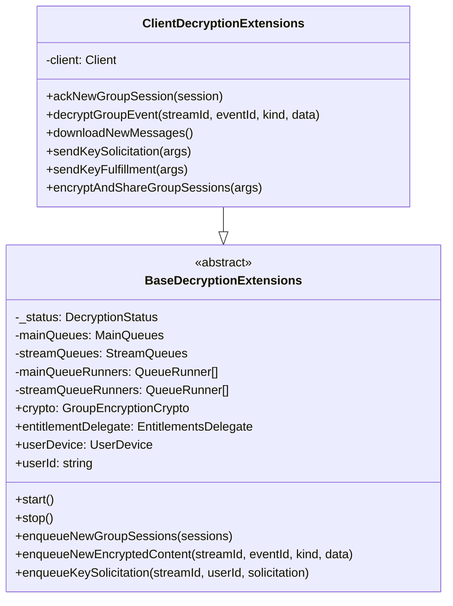

## Queue System

### Main Queues

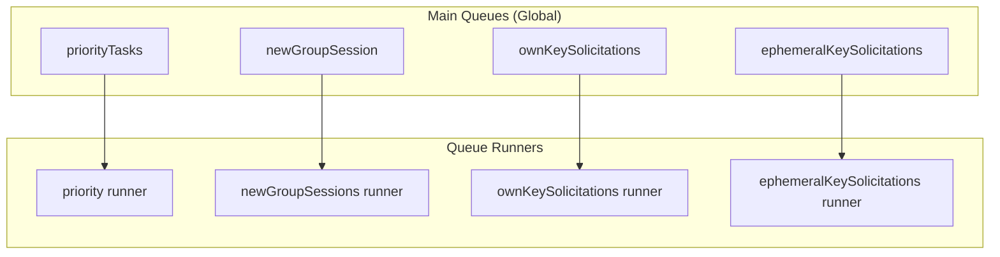

### Stream Queues

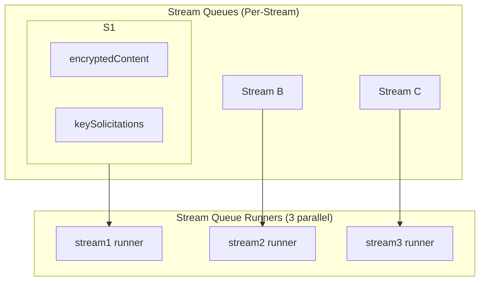

## Status States

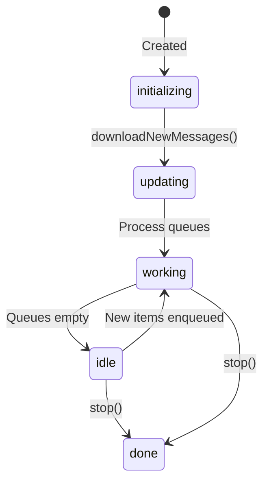

## Key Solicitation Flow

When a message can't be decrypted due to missing session keys:

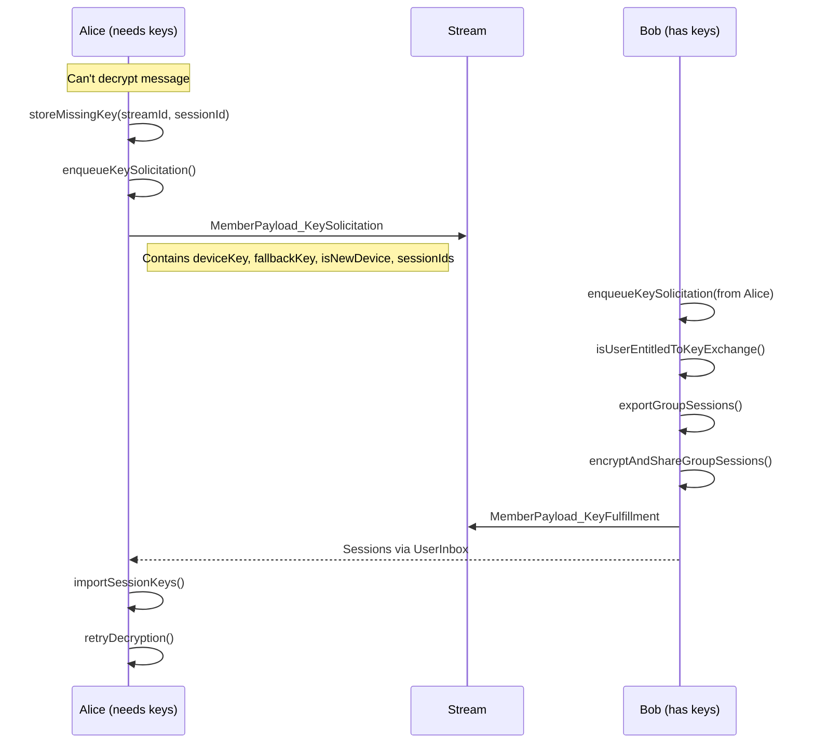

## Key Fulfillment Flow

When responding to a key solicitation:

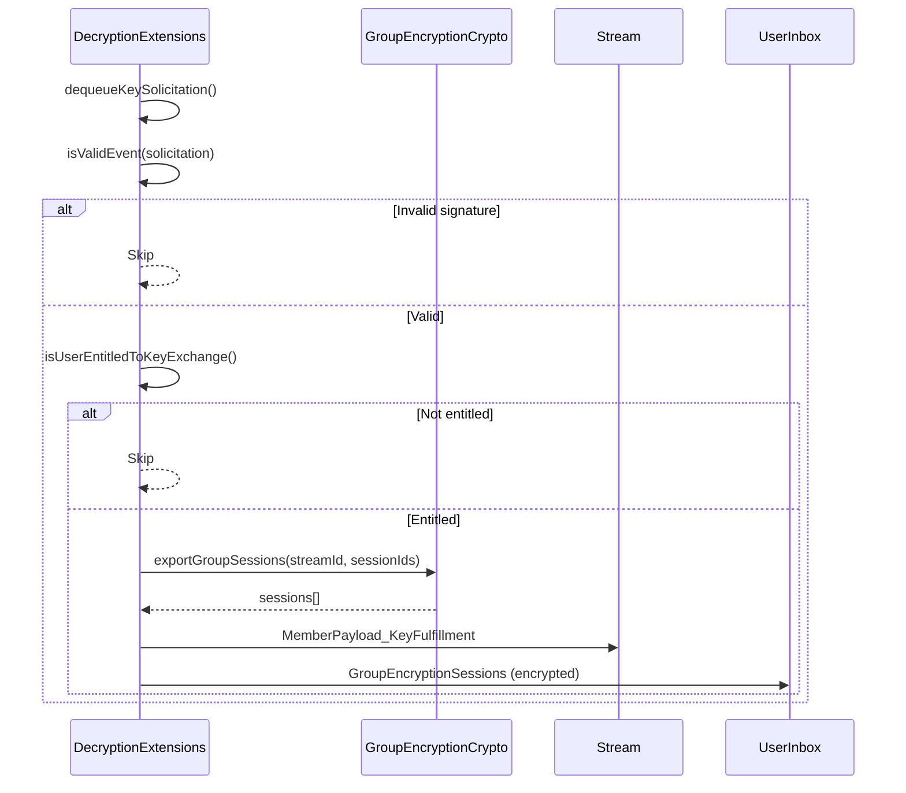

## Encrypted Content Processing

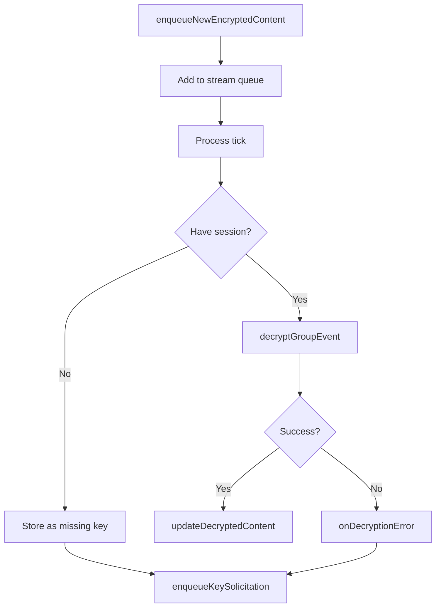

## Processing Priority

Stream queues are processed in priority order:

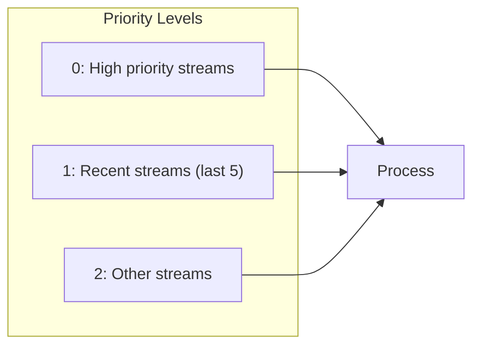

## Data Types

### EncryptedContentItem

```typescript
interface EncryptedContentItem {
    streamId: string
    eventId: string
    kind: string          // 'text', 'channelMessage', 'channelProperties', etc.
    encryptedData: EncryptedData
}
```

### KeySolicitationContent

```typescript
interface KeySolicitationContent {
    deviceKey: string     // Requestor's device public key
    fallbackKey: string   // Requestor's fallback key
    isNewDevice: boolean  // First-time key request
    sessionIds: string[]  // Sessions being requested
}
```

### KeySolicitationItem

```typescript
interface KeySolicitationItem {
    streamId: string
    fromUserId: string
    solicitation: KeySolicitationContent
    respondAfter: number  // ms since epoch (for rate limiting)
    sigBundle: EventSignatureBundle
    hashStr: string
    ephemeral?: boolean
}
```

## Ephemeral vs Persistent Solicitations

| Type | Storage | Use Case |
|------|---------|----------|
| **Persistent** | On-chain in stream | New device joining, long-term key requests |
| **Ephemeral** | Temporary, 30s timeout | Quick key exchange during active session |

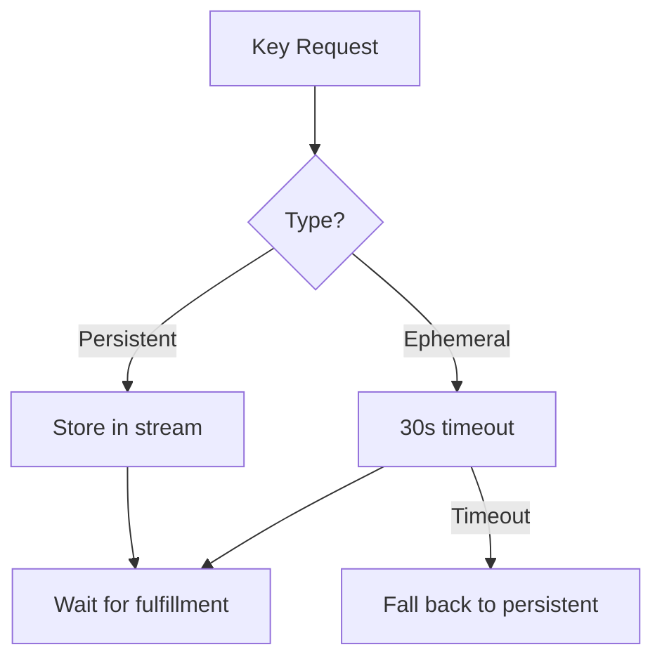

## Entitlement Checking

Before sharing keys, the system validates entitlements:

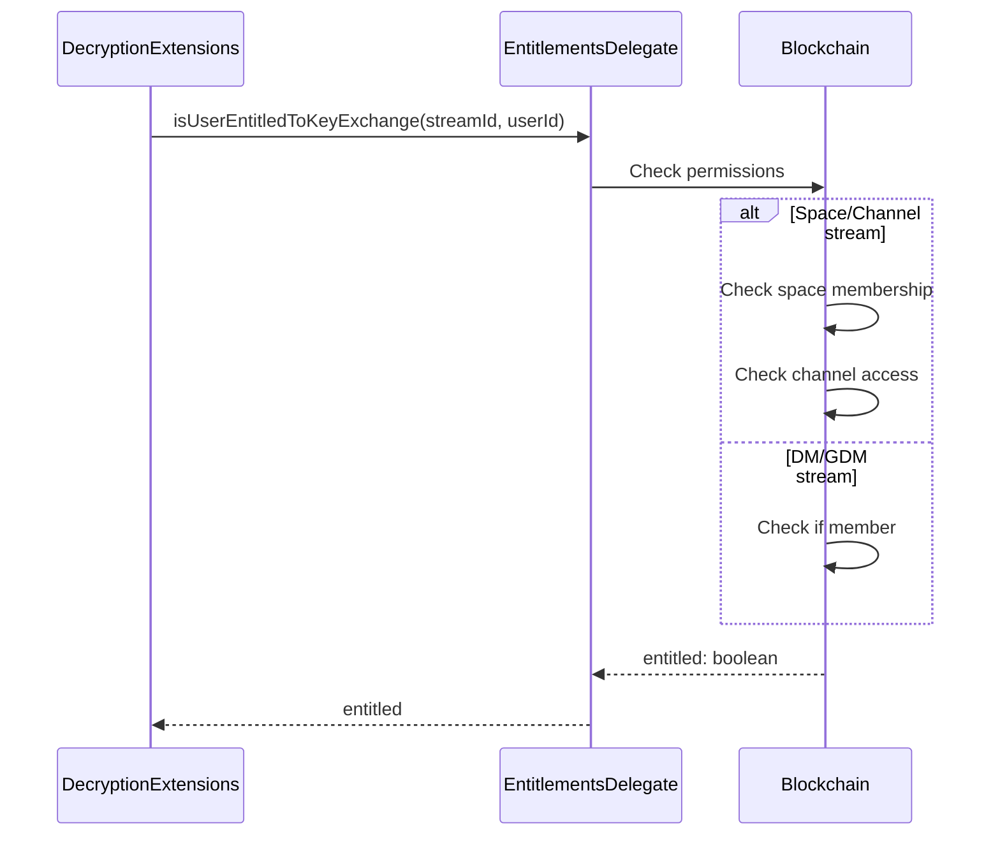

## Rate Limiting

Key solicitations include `respondAfter` to prevent spam:

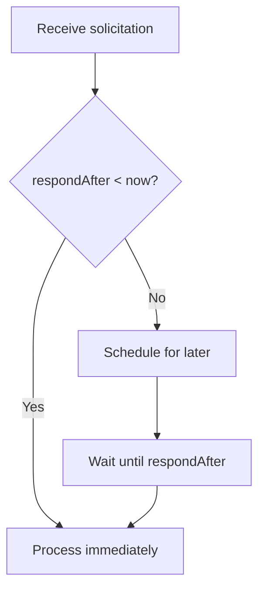

## Decryption Failure Tracking

```typescript
// Tracks failed decryptions for retry
decryptionFailures: Record<
    string,                    // streamId
    Record<
        string,                // sessionId
        EncryptedContentItem[] // Failed items
    >
>
```

When a session key is received, all failed items for that session are retried.

## Queue Runner

Each queue has a dedicated runner:

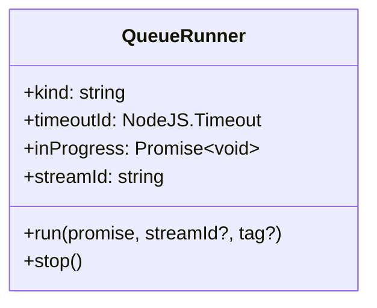

Runners:
- Process one item at a time
- Auto-restart on completion
- Can be stopped gracefully

## Source Files

| File | Description |
|------|-------------|
| `src/decryptionExtensions.ts` | BaseDecryptionExtensions abstract class (~47KB) |
| `src/clientDecryptionExtensions.ts` | Client implementation |
| `src/encryptedContentTypes.ts` | Content type definitions |
