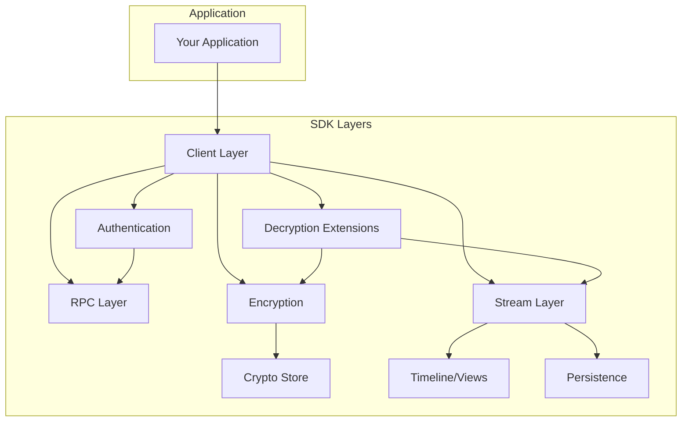
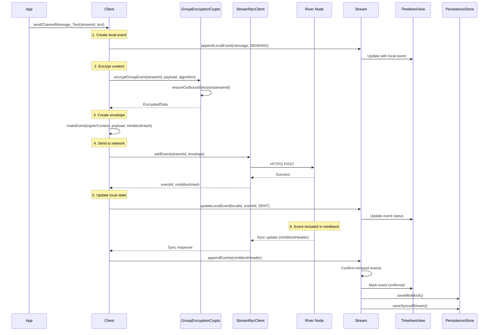
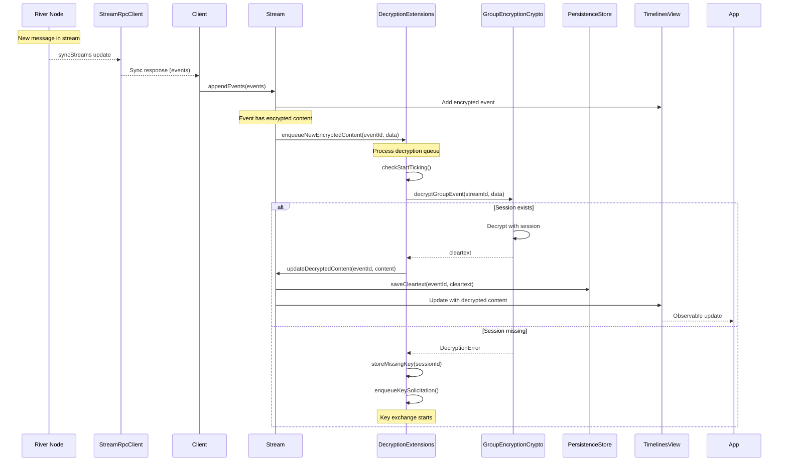
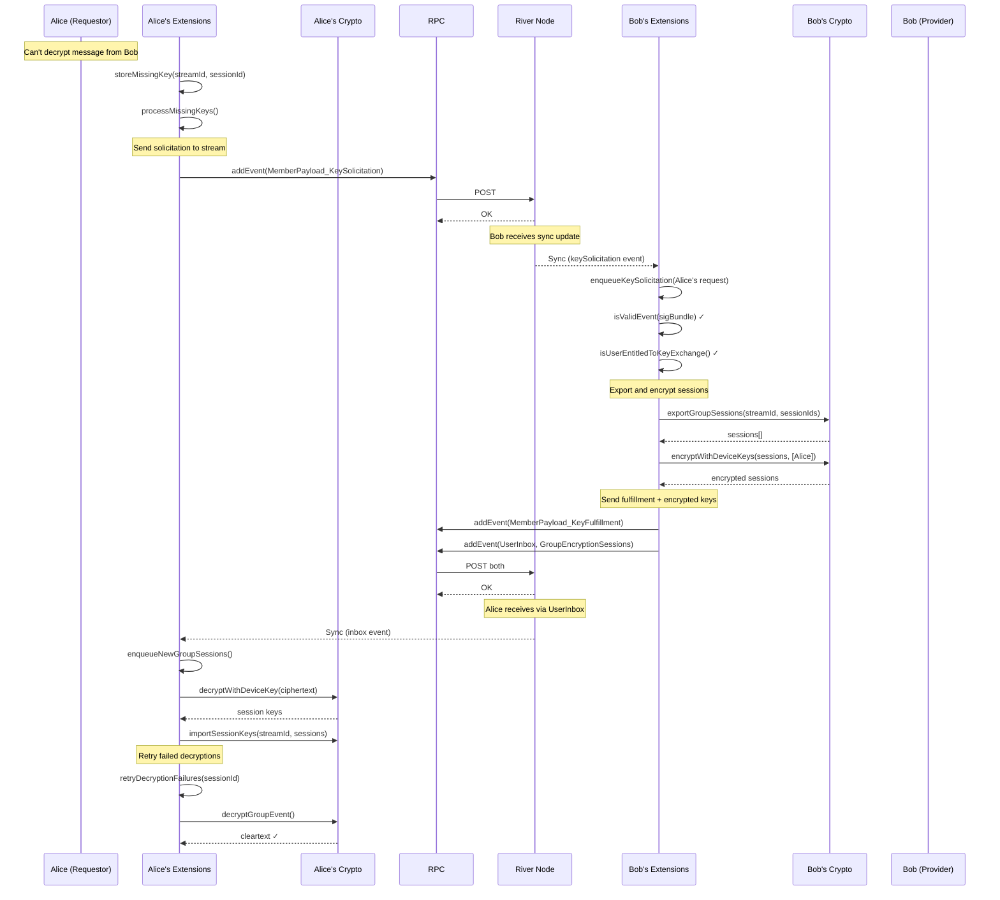
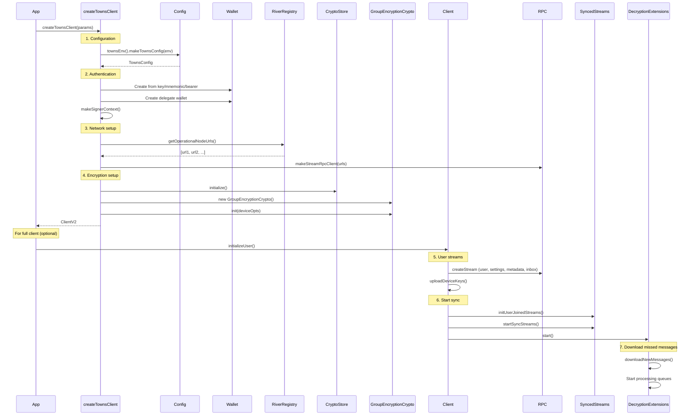
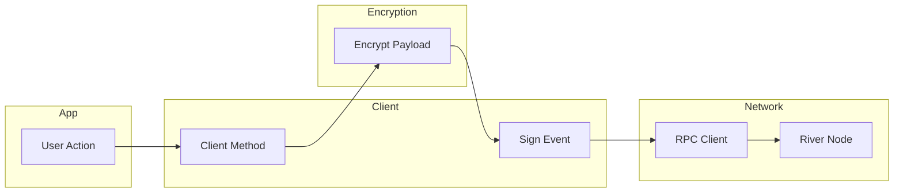
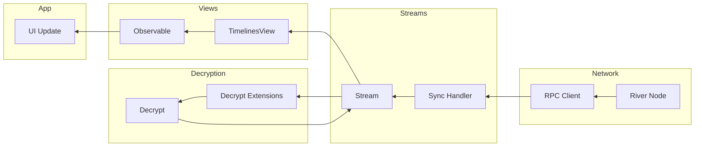
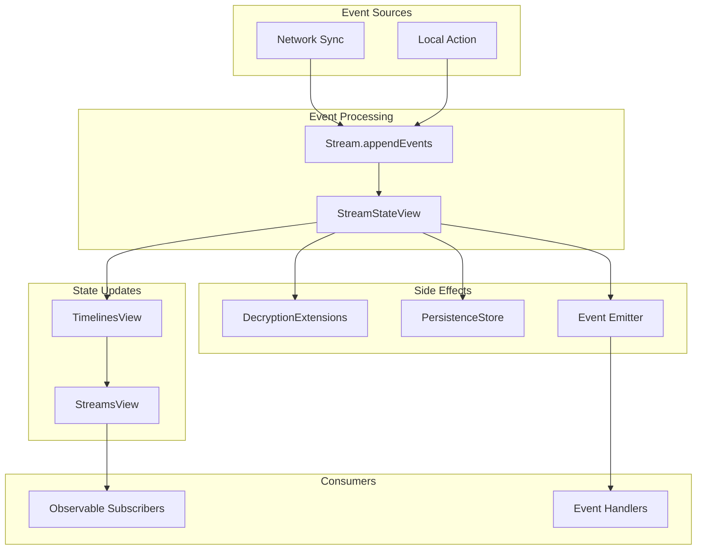
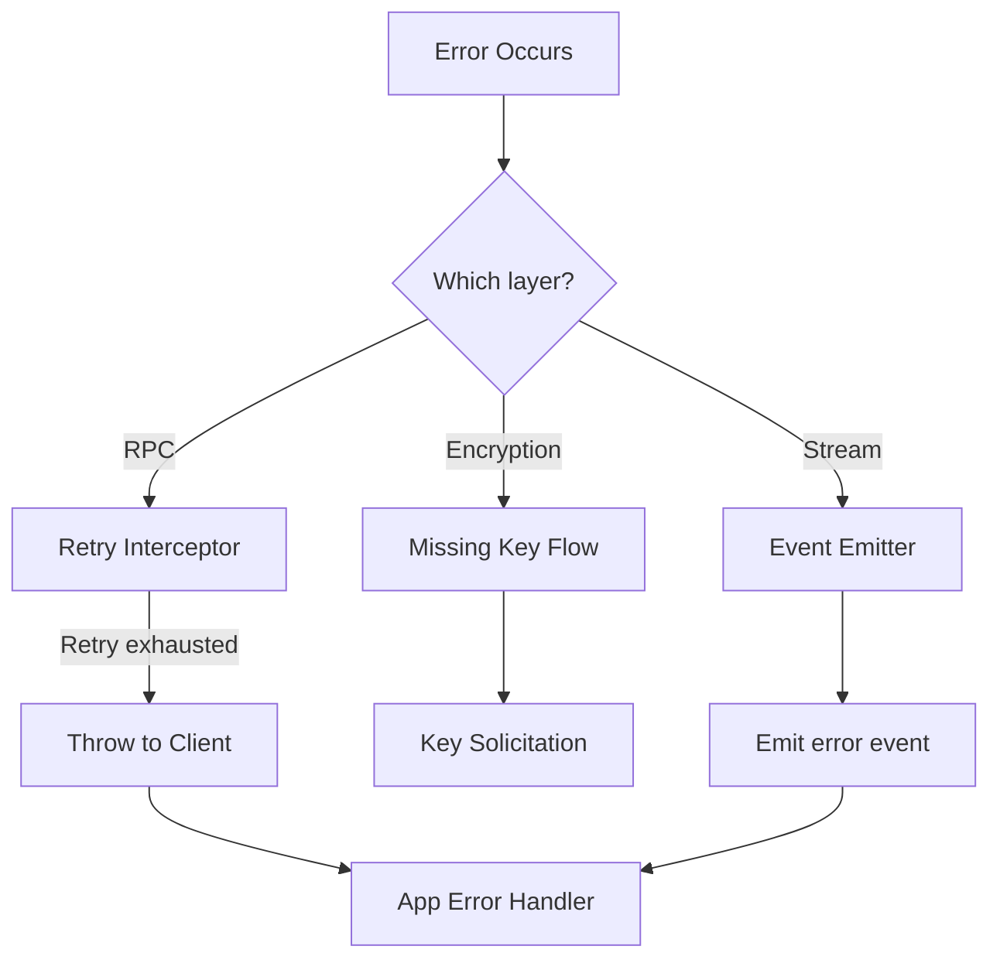

# Layer Integration

This document describes how the SDK layers communicate and shows complete end-to-end data flows.

## Layer Dependencies

## Complete Message Send Flow

Sending an encrypted message from user input to server confirmation:

## Complete Message Receive Flow

Receiving and decrypting a message from another user:

## Complete Key Exchange Flow

Full key solicitation and fulfillment between two users:

## Initialization Flow

Complete client startup sequence:

## Data Flow Through Layers

### Outbound (App → Network)

### Inbound (Network → App)

## Cross-Layer Event Flow

How events propagate through the system:

## Layer Communication Patterns

| From | To | Method | Data |
|------|-----|--------|------|
| Client | RPC | Method call | Protobuf request |
| RPC | Client | Promise/callback | Protobuf response |
| Client | Crypto | Method call | Payload + streamId |
| Crypto | CryptoStore | Method call | Session data |
| Client | Stream | Method call | Events |
| Stream | Timeline | Observable update | TimelineEvent |
| Timeline | App | Subscribe callback | Model data |
| Extensions | Crypto | Method call | Encrypted data |
| Extensions | Stream | Method call | Decrypted content |
| Stream | Persistence | Async save | Miniblocks, cleartexts |

## Error Propagation

## Summary

The SDK's layered architecture enables:

1. **Separation of concerns** - Each layer handles specific functionality
2. **Testability** - Layers can be tested in isolation
3. **Flexibility** - Layers can be replaced or extended
4. **Offline capability** - Persistence and crypto stores enable offline operation
5. **Reactive UI** - Observable pattern enables efficient UI updates
6. **End-to-end encryption** - Seamless key exchange and message encryption
