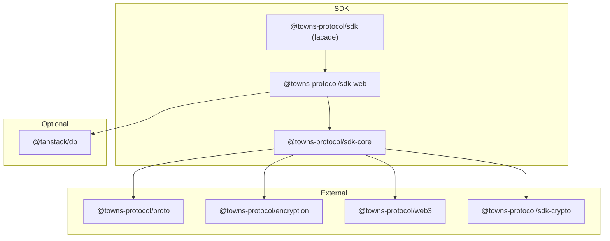

# Final SDK Architecture Proposal

## Executive Summary

This document consolidates the SDK architecture proposals into a unified plan centered around a **package split** (`sdk-core` / `sdk-web`) that enables tree-shaking, platform-specific optimizations, and better developer experience.

---

## Current State

### Existing Packages

```
@towns-protocol/sdk          → Monolithic, browser-coupled
@towns-protocol/sdk-crypto   → Already split (node/web conditional exports) ✓
@towns-protocol/react-sdk    → To be replaced by TanStack DB integration
```

### Key Problems

| Problem | Impact |
|---------|--------|
| Browser APIs coupled to core logic | Can't use SDK in Node.js without polyfills |
| Dexie (IndexedDB) imported unconditionally | Bundle bloat for bots/servers |
| Triple data duplication in StreamStateView | ~830MB memory for heavy users |
| Custom Observable pattern | Manual subscription management, no cross-stream queries |
| No tree-shaking | Full SDK bundled even for simple use cases |

---

## Target Architecture

### Package Structure

```
@towns-protocol/sdk-core     → Platform-agnostic (zero browser/node APIs)
@towns-protocol/sdk-web      → Browser-specific (IndexedDB, TanStack DB)
@towns-protocol/sdk-crypto   → Already exists (node/web conditional exports)
@towns-protocol/sdk          → Facade for backwards compat (eventually deprecated)
```

### Dependency Graph



---

## Package Responsibilities

### sdk-core

**Zero platform-specific APIs.** Can run in Node.js, browsers, Deno, Bun, edge workers.

```
sdk-core/
├── client/
│   ├── createClient.ts         → Base client factory
│   └── types.ts                → TownsClient interface
├── auth/
│   ├── signerContext.ts        → Wallet delegation
│   └── types.ts                → SignerContext interface
├── rpc/
│   ├── streamRpcClient.ts      → RPC layer
│   └── interceptors.ts         → Auth interceptors
├── encryption/
│   ├── groupEncryption.ts      → Encryption logic
│   ├── decryptionExtensions.ts → Key exchange
│   └── types.ts                → CryptoAdapter interface
├── streams/
│   ├── stream.ts               → Stream/SyncedStream
│   ├── streamStateView.ts      → Optimized state (Phase 1-6)
│   ├── eventStore.ts           → Normalized event storage
│   └── types.ts                → Stream types
├── persistence/
│   ├── types.ts                → PersistenceAdapter interface
│   └── memory.ts               → In-memory adapter (for bots)
├── observable/
│   ├── observable.ts           → Core observable pattern
│   └── computed.ts             → Computed/derived values
├── message/                    → Composable message builders
│   ├── text.ts
│   ├── mention.ts
│   ├── attachment.ts
│   ├── poll.ts
│   └── combine.ts
├── actions/                    → Standalone action functions
│   ├── messaging.ts            → sendMessage, editMessage, etc.
│   ├── spaces.ts               → createSpace, joinSpace, etc.
│   └── streams.ts              → getStream, syncStream, etc.
└── index.ts                    → Public exports
```

### sdk-web

**Browser-specific implementations.** Depends on sdk-core.

```
sdk-web/
├── client/
│   └── createWebClient.ts      → Web client with defaults
├── persistence/
│   ├── indexeddb.ts            → IndexedDB via Dexie
│   └── persistenceStore.ts     → Current PersistenceStore (wrapped)
├── crypto/
│   └── wasm.ts                 → WASM crypto bindings (if needed)
├── tanstack/                   → TanStack DB integration
│   ├── collections/
│   │   ├── messages.ts         → MessagesCollection
│   │   ├── members.ts          → MembersCollection
│   │   └── spaces.ts           → SpacesCollection
│   ├── queries/
│   │   ├── useTimeline.ts      → Timeline live query
│   │   ├── useMembers.ts       → Members live query
│   │   └── useSpaces.ts        → Spaces live query
│   └── index.ts
└── index.ts                    → Re-exports sdk-core + web-specific
```

---

## Core Interfaces

### CryptoAdapter

```typescript
interface CryptoAdapter {
  // Initialization
  init(opts?: EncryptionDeviceInitOpts): Promise<void>
  getUserDevice(): UserDevice

  // Group encryption
  encryptGroupEvent(streamId: string, payload: Uint8Array, algorithm: GroupEncryptionAlgorithmId): Promise<EncryptedData>
  decryptGroupEvent(streamId: string, content: EncryptedData): Promise<Uint8Array>
  ensureOutboundSession(streamId: string, algorithm: GroupEncryptionAlgorithmId): Promise<string>
  hasOutboundSession(streamId: string, algorithm: GroupEncryptionAlgorithmId): Promise<boolean>

  // Device-to-device
  encryptWithDeviceKeys(payload: string, deviceKeys: UserDevice[]): Promise<Record<string, string>>
  decryptWithDeviceKey(ciphertext: string, senderDeviceKey: string): Promise<string>

  // Session management
  hasSessionKey(streamId: string, sessionId: string, algorithm: GroupEncryptionAlgorithmId): Promise<boolean>
  exportGroupSession(streamId: string, sessionId: string): Promise<GroupEncryptionSession | undefined>
  importSessionKeys(streamId: string, keys: GroupEncryptionSession[]): Promise<void>

  // Export
  exportDevice(): Promise<ExportedDevice>
}
```

### PersistenceAdapter

```typescript
interface PersistenceAdapter {
  // Cleartexts
  saveCleartext(eventId: string, cleartext: Uint8Array | string): Promise<void>
  getCleartext(eventId: string): Promise<Uint8Array | string | undefined>
  getCleartexts(eventIds: string[]): Promise<Record<string, Uint8Array | string> | undefined>

  // Stream state
  getSyncedStream(streamId: string): Promise<ParsedPersistedSyncedStream | undefined>
  saveSyncedStream(streamId: string, syncedStream: PersistedSyncedStream): Promise<void>
  loadStream(streamId: string): Promise<LoadedStream | undefined>
  loadStreams(streamIds: string[]): Promise<{ streams: Record<string, LoadedStream | undefined>, lastAccessedAt: Record<string, number> }>

  // Miniblocks
  saveMiniblock(streamId: string, miniblock: ParsedMiniblock): Promise<void>
  saveMiniblocks(streamId: string, miniblocks: ParsedMiniblock[], direction: 'forward' | 'backward'): Promise<void>
  getMiniblock(streamId: string, miniblockNum: bigint): Promise<ParsedMiniblock | undefined>
  getMiniblocks(streamId: string, rangeStart: bigint, rangeEnd: bigint): Promise<ParsedMiniblock[]>

  // Snapshots
  saveSnapshot(streamId: string, miniblockNum: bigint, snapshot: Snapshot): Promise<void>

  // Priority
  setHighPriorityStreams(streamIds: string[]): void
}
```

### TownsClient (Base)

```typescript
interface TownsClient {
  readonly userId: string
  readonly signerContext: SignerContext
  readonly rpc: StreamRpcClient
  readonly config: TownsConfig
  readonly crypto: CryptoAdapter
  readonly persistence?: PersistenceAdapter

  // Extension pattern
  extend<T extends Record<string, unknown>>(
    fn: (client: TownsClient) => T
  ): TownsClient & T
}
```

---

## Implementation Phases

### Phase 0: Interface Extraction (Foundation)

**Goal:** Define adapter interfaces without breaking existing code.

| Task | Files Affected |
|------|----------------|
| Define `CryptoAdapter` interface | New: `sdk-core/encryption/types.ts` |
| Define `PersistenceAdapter` interface | New: `sdk-core/persistence/types.ts` |
| Create in-memory persistence adapter | New: `sdk-core/persistence/memory.ts` |
| Wrap existing GroupEncryptionCrypto | Existing: `encryption/` |
| Wrap existing PersistenceStore | Existing: `storage/` |

**Deliverable:** Interfaces defined, existing code wrapped to implement them.

---

### Phase 1: StreamState Optimization

**Goal:** 40-60% memory reduction, independent of package split.

| Step | Description | Memory Impact |
|------|-------------|---------------|
| 1.1 | Normalize event storage (single `EventStore`) | -300MB |
| 1.2 | Mutable updates with change tracking | Reduced GC |
| 1.3 | Lazy transformation (transform on access) | -100MB |
| 1.4 | Consolidate member data structures | -50MB |
| 1.5 | Index-based lookups (O(1) instead of O(n)) | Performance |
| 1.6 | Bounded edit history (ring buffer) | Prevents growth |

**Files Affected:**
- `streamStateView.ts` → Use EventStore
- `streamStateView_Members.ts` → Consolidate structures
- `timelinesModel.ts` → Major refactor
- `observable.ts` → Add batched notifications

---

### Phase 2: Create sdk-core Package

**Goal:** Extract platform-agnostic code into new package.

| Step | Description |
|------|-------------|
| 2.1 | Create `packages/sdk-core/` with package.json |
| 2.2 | Move stream logic, RPC, auth (no browser deps) |
| 2.3 | Move encryption logic (uses sdk-crypto) |
| 2.4 | Move observable pattern |
| 2.5 | Create `createClient` factory with explicit deps |
| 2.6 | Add message builders (`text()`, `mention()`, `combine()`) |
| 2.7 | Add standalone actions (`sendMessage()`, etc.) |

**Key Constraint:** Zero imports of `dexie`, `indexeddb`, `window`, `document`.

---

### Phase 3: Create sdk-web Package

**Goal:** Browser-specific implementations.

| Step | Description |
|------|-------------|
| 3.1 | Create `packages/sdk-web/` with package.json |
| 3.2 | Move IndexedDB persistence (Dexie wrapper) |
| 3.3 | Create `createWebClient` with browser defaults |
| 3.4 | Re-export all of sdk-core |

---

### Phase 4: TanStack DB Integration

**Goal:** Replace Observable + TimelinesView with reactive queries.

| Step | Description |
|------|-------------|
| 4.1 | Add `@tanstack/db` dependency to sdk-web |
| 4.2 | Create `RiverCollection` bridging streams → collections |
| 4.3 | Create `MessagesCollection`, `MembersCollection`, etc. |
| 4.4 | Create live query hooks (`useTimeline`, `useMembers`) |
| 4.5 | Migrate TimelinesView consumers to live queries |
| 4.6 | Remove Observable pattern (or keep for non-React) |

---

### Phase 5: DX Primitives

**Goal:** Developer-friendly APIs built on new architecture.

| Primitive | Package | Priority |
|-----------|---------|----------|
| Composable messages (`text()`, `mention()`) | sdk-core | P0 |
| Standalone actions (`sendMessage(client, {...})`) | sdk-core | P0 |
| Effect system (`onMessage()`, `filter()`) | sdk-core | P1 |
| Presence & typing indicators | sdk-core | P1 |
| Transaction batching | sdk-core | P2 |
| Offline queue | sdk-web | P2 |
| Bot framework | sdk-core | P3 |
| Testing utilities | sdk-core | P3 |

---

## Blocking Tasks

| Task | Blocks | Status |
|------|--------|--------|
| Define `CryptoAdapter` interface | Phase 2 | Not started |
| Define `PersistenceAdapter` interface | Phase 2 | Not started |
| Audit for `globalThis`/`window` usage in core | Phase 2 | Not started |
| Audit circular dependencies | Phase 2 | Not started |
| Decouple Dexie imports from core logic | Phase 2 | Not started |
| TypeScript project references setup | Phase 2, 3 | Not started |
| Package.json exports configuration | Phase 2, 3 | Precedent in sdk-crypto |

---

## Usage Examples After Implementation

### Bot (Node.js) - Minimal Bundle

```typescript
import { createClient, memoryPersistence } from '@towns-protocol/sdk-core'
import { sendMessage, text, mention, combine } from '@towns-protocol/sdk-core'

const client = await createClient({
  env: 'mainnet',
  auth: { privateKey: process.env.BOT_KEY },
  persistence: memoryPersistence(),
})

// Composable message builders
await sendMessage(client, {
  streamId: channelId,
  content: combine(
    text('Hello '),
    mention(userId),
    text('! Welcome to the channel.')
  ),
})
```

### Browser App - Full Features

```typescript
import { createWebClient } from '@towns-protocol/sdk-web'
import { useLiveQuery } from '@towns-protocol/sdk-web/tanstack'

// Client with IndexedDB persistence, WASM crypto
const client = await createWebClient({
  env: 'mainnet',
  auth: { privateKey },
})

// React component with live queries
function ChannelMessages({ channelId }) {
  const { data: messages } = useLiveQuery(
    (q) => q
      .from(client.collections.messages)
      .where('streamId', '=', channelId)
      .orderBy('createdAt', 'asc'),
    [channelId]
  )

  return <MessageList messages={messages} />
}
```

### Standalone Actions (Tree-Shakeable)

```typescript
// Only import what you use - rest is tree-shaken
import { createClient } from '@towns-protocol/sdk-core'
import { joinSpace } from '@towns-protocol/sdk-core/actions/spaces'
import { sendMessage } from '@towns-protocol/sdk-core/actions/messaging'

const client = await createClient({ /* ... */ })

await joinSpace(client, { spaceId })
await sendMessage(client, { streamId, content: 'Hello!' })
```

---

## Success Metrics

| Metric | Current | Target |
|--------|---------|--------|
| Memory per 1K events | ~5.5MB | ~2.5MB |
| Bot bundle size | ~500KB+ | <100KB |
| Browser bundle (full) | ~800KB | ~400KB |
| Time to add event | ~15ms | ~5ms |
| React subscription code | Manual useEffect | `useLiveQuery` one-liner |

---

## Priority Summary

| Priority | Work Item | Dependencies |
|----------|-----------|--------------|
| **P0** | Interface extraction (CryptoAdapter, PersistenceAdapter) | None |
| **P0** | Create sdk-core package | Interface extraction |
| **P1** | StreamState optimization | None (parallel work) |
| **P1** | Create sdk-web package | sdk-core |
| **P2** | TanStack DB integration | sdk-web |
| **P2** | Composable messages & actions | sdk-core |
| **P3** | Effect system, presence | sdk-core |
| **P3** | Bot framework, testing utilities | sdk-core |

---

## References

- [Modular Client Proposal](./modular-client.md)
- [StreamState Optimization](./streamstate-optimization.md)
- [TanStack DB Proposal](./tanstackdb.md)
- [DX Primitives](./imaginary-dx-api.md)
- [sdk-crypto package](../../sdk-crypto/) - Reference for conditional exports
