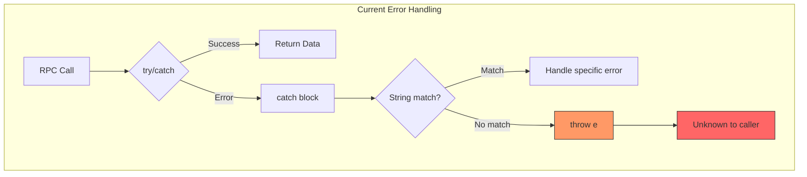
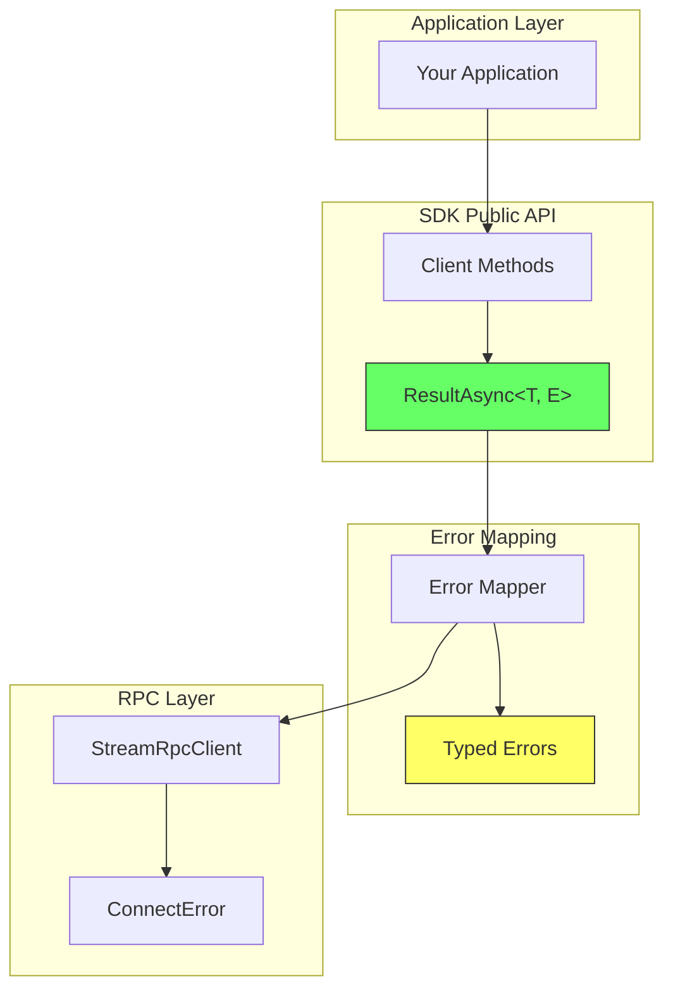
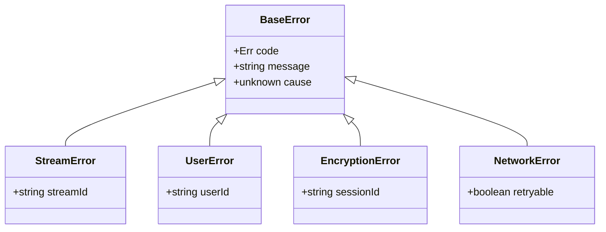

# Proposal: Type-Safe Error Handling with Result Types

## Problem Statement

### Current State

The SDK uses traditional try/catch error handling with ConnectRPC's `ConnectError`:

```typescript
// Current pattern in client code
try {
  const response = await client.getStream({ streamId })
  return response
} catch (e) {
  if (isIConnectError(e) && e.code === Code.NotFound) {
    // Handle not found
  }
  throw e
}
```

### Issues

#### 1. Lost Type Information

TypeScript cannot infer "throw types". When a function throws, the error type is lost:

```typescript
async function getUser(id: string): Promise<User> {
  const response = await client.getUser({ id })
  if (!response.user) {
    throw new Error("User not found") // Type information lost
  }
  return response.user
}

// Caller has no idea what errors to expect
const user = await getUser("123") // What can go wrong? 🤷
```

#### 2. String-Based Error Matching

The current SDK uses string matching to identify error types (`rpcInterceptors.ts:357-365`):

```typescript
export function errorContains(err: unknown, error: Err): boolean {
  if (err !== null && typeof err === 'object' && 'message' in err) {
    const expected = `${error.valueOf()}:${Err[error]}`
    return (err.message as string).includes(expected)
  }
  return false
}
```

This is fragile and provides no compile-time guarantees.

#### 3. Silent Error Handling Failures

Nothing prevents developers from forgetting to handle errors:

```typescript
// Easy to forget error handling
const stream = await client.getStream({ streamId })
// If this throws, the error bubbles up unhandled
```

#### 4. Unclear Error Contracts

Looking at a function signature, there's no way to know what errors it can produce:

```typescript
// What errors can this throw?
async function joinSpace(spaceId: string): Promise<void>

// Could be: NOT_FOUND, PERMISSION_DENIED, ALREADY_EXISTS, NETWORK_ERROR...
// But the type system doesn't tell us
```

### Error Flow Diagram (Current)



## Proposed Solution

### Use Result Types with neverthrow

Replace exceptions with explicit Result types that encode success and failure in the type system.

```typescript
import { Result, ResultAsync, ok, err } from 'neverthrow'

// Error types are explicit in the signature
function getUser(id: string): ResultAsync<User, UserError> {
  return ResultAsync.fromPromise(
    client.getUser({ id }),
    (e) => mapToUserError(e)
  )
}

// Caller MUST handle both cases
const result = await getUser("123")
result.match(
  (user) => console.log(user.name),
  (error) => {
    if (error.type === 'NOT_FOUND') {
      // TypeScript knows this is a valid error type
    }
  }
)
```

### Error Flow Diagram (Proposed)

```mermaid
flowchart TD
    subgraph "Proposed Error Handling"
        Call[RPC Call] --> Wrap[ResultAsync.fromPromise]
        Wrap --> Map[Map to typed error]
        Map --> Result[Result&lt;T, E&gt;]
        Result --> Match{.match()}
        Match -->|Ok| Success[Handle success]
        Match -->|Err| Error[Handle typed error]
    end

    style Result fill:#6f6,stroke:#333
    style Success fill:#6f6,stroke:#333
    style Error fill:#ff6,stroke:#333
```

## Implementation

### 1. Define Domain Error Types

Create typed error unions that map to protocol errors:

```typescript
// packages/sdk/src/errors/types.ts
import { Err } from '@towns-protocol/proto'

// Base error structure
interface BaseError {
  code: Err
  message: string
  cause?: unknown
}

// Stream-specific errors
type StreamError =
  | { code: Err.NOT_FOUND; message: string; streamId: string }
  | { code: Err.PERMISSION_DENIED; message: string; streamId: string }
  | { code: Err.BAD_STREAM_ID; message: string; streamId: string }

// User-specific errors
type UserError =
  | { code: Err.NOT_FOUND; message: string; userId: string }
  | { code: Err.UNAUTHENTICATED; message: string }
  | { code: Err.PERMISSION_DENIED; message: string }

// Network errors (non-recoverable)
type NetworkError = {
  code: Err.UNAVAILABLE | Err.DEADLINE_EXCEEDED
  message: string
  retryable: boolean
}
```

### 2. Create Error Mapping Utilities

```typescript
// packages/sdk/src/errors/mapper.ts
import { ConnectError, Code } from '@connectrpc/connect'
import { Err } from '@towns-protocol/proto'

export function mapConnectError<E>(
  error: unknown,
  mapper: (code: Err, message: string) => E
): E {
  const connectError = ConnectError.from(error)

  // Extract Err enum from message (current pattern)
  const errCode = extractErrFromMessage(connectError.message)

  return mapper(errCode ?? Err.UNKNOWN, connectError.rawMessage)
}

function extractErrFromMessage(message: string): Err | undefined {
  // Match pattern "CODE:NAME" in error message
  for (const [name, value] of Object.entries(Err)) {
    if (typeof value === 'number') {
      const pattern = `${value}:${name}`
      if (message.includes(pattern)) {
        return value as Err
      }
    }
  }
  return undefined
}
```

### 3. Create RPC Wrapper

```typescript
// packages/sdk/src/errors/safeRpc.ts
import { ResultAsync } from 'neverthrow'
import { mapConnectError } from './mapper'

export function safeRpc<T, E>(
  call: () => Promise<T>,
  errorMapper: (code: Err, message: string) => E
): ResultAsync<T, E> {
  return ResultAsync.fromPromise(
    call(),
    (error) => mapConnectError(error, errorMapper)
  )
}
```

### 4. Update Client Methods

```typescript
// Before
class Client {
  async getStream(streamId: string): Promise<Stream> {
    const response = await this.rpc.getStream({ streamId: streamIdAsBytes(streamId) })
    return new Stream(response)
  }
}

// After
class Client {
  getStream(streamId: string): ResultAsync<Stream, StreamError> {
    return safeRpc(
      () => this.rpc.getStream({ streamId: streamIdAsBytes(streamId) }),
      (code, message) => {
        switch (code) {
          case Err.NOT_FOUND:
            return { code, message, streamId }
          case Err.PERMISSION_DENIED:
            return { code, message, streamId }
          default:
            return { code: Err.UNKNOWN, message, streamId }
        }
      }
    ).map(response => new Stream(response))
  }
}
```

### 5. Usage Examples

#### Basic Usage

```typescript
const result = await client.getStream("stream-123")

// Pattern matching (exhaustive)
result.match(
  (stream) => {
    console.log("Got stream:", stream.name)
  },
  (error) => {
    switch (error.code) {
      case Err.NOT_FOUND:
        console.log("Stream not found:", error.streamId)
        break
      case Err.PERMISSION_DENIED:
        console.log("Access denied to stream:", error.streamId)
        break
    }
  }
)
```

#### Chaining Operations

```typescript
const result = await client.getSpace(spaceId)
  .andThen(space => client.getChannel(space.defaultChannelId))
  .andThen(channel => client.sendMessage(channel.id, "Hello!"))

// All errors from the chain are typed
result.match(
  (message) => console.log("Sent:", message.id),
  (error) => console.log("Failed:", error.code, error.message)
)
```

#### Unwrapping (Escape Hatch)

```typescript
// When you want to throw (e.g., in tests)
const stream = (await client.getStream(streamId))._unsafeUnwrap()

// With default value
const stream = (await client.getStream(streamId)).unwrapOr(defaultStream)

// Check and extract
const result = await client.getStream(streamId)
if (result.isOk()) {
  const stream = result.value // TypeScript knows this is Stream
}
```

## Architecture

### Layer Integration



### Error Type Hierarchy



## Migration Strategy

### Phase 1: Add Infrastructure

1. Add `neverthrow` dependency
2. Create error types and mapper utilities
3. Add `safeRpc` wrapper

### Phase 2: New Methods Use Result

1. All new client methods return `ResultAsync`
2. Document the pattern in contributing guidelines
3. Add ESLint plugin for enforcement

### Phase 3: Gradual Migration

1. Add Result-returning variants of existing methods
2. Deprecate exception-throwing methods
3. Update documentation and examples

### Phase 4: Breaking Change (Major Version)

1. Remove deprecated methods
2. All public API returns Result types
3. Update all examples and tests

## Comparison

| Aspect | Current (try/catch) | neverthrow | Effect-TS |
|--------|---------------------|------------|-----------|
| Type safety | Partial | Full | Full |
| Error visibility | Hidden in impl | In signature | In signature |
| Forgotten handling | Silent bugs | Compile error | Compile error |
| Chaining | Awkward | `.andThen()` | `pipe()` + `flatMap` |
| Learning curve | Familiar | Low | High |
| Bundle size | None | ~5KB | ~50KB+ |
| Ecosystem compat | Native | Easy wrapping | Paradigm shift |
| Built-in retry | Manual | Manual | Built-in |
| Dependency injection | N/A | Manual | Built-in services |
| Observability | Manual | Manual | Built-in tracing |
| Community | N/A | 5.4k stars | 8k stars |

## Alternatives Considered

### 1. Union Return Types

```typescript
type GetStreamResult =
  | { ok: true; data: Stream }
  | { ok: false; error: StreamError }

async function getStream(id: string): Promise<GetStreamResult>
```

**Pros**: No dependencies
**Cons**: No helper methods, verbose

### 2. Effect-TS

[Effect-TS](https://github.com/Effect-TS/effect) is a comprehensive effect system for TypeScript with 8k+ stars.

```typescript
import { Effect, pipe } from 'effect'

// Define error types
class StreamNotFound extends Data.TaggedError("StreamNotFound")<{
  streamId: string
}> {}

class PermissionDenied extends Data.TaggedError("PermissionDenied")<{
  streamId: string
}> {}

// Function signature shows all possible errors
const getStream = (id: string): Effect.Effect<
  Stream,
  StreamNotFound | PermissionDenied
> =>
  Effect.tryPromise({
    try: () => client.getStream({ id }),
    catch: (e) => {
      const err = ConnectError.from(e)
      if (err.code === Code.NotFound) {
        return new StreamNotFound({ streamId: id })
      }
      return new PermissionDenied({ streamId: id })
    }
  })

// Usage with pipe
const program = pipe(
  getStream("123"),
  Effect.flatMap(stream => getChannel(stream.defaultChannelId)),
  Effect.flatMap(channel => sendMessage(channel.id, "Hello")),
  Effect.catchTag("StreamNotFound", (e) =>
    Effect.succeed(console.log("Stream not found:", e.streamId))
  )
)

// Run the effect
await Effect.runPromise(program)
```

**Pros**:
- Most powerful error handling in TypeScript ecosystem
- Tagged errors with `catchTag` for precise handling
- Built-in retry, timeout, concurrency primitives
- Dependency injection via services
- Comprehensive tracing and logging
- Growing ecosystem and community

**Cons**:
- Larger bundle (~50KB+ depending on features)
- Steeper learning curve (functional programming concepts)
- Paradigm shift from imperative to declarative
- May be overkill for simple use cases

**When to consider Effect-TS**:
- Building complex business logic with many failure modes
- Need built-in retry policies, rate limiting, circuit breakers
- Want full observability (tracing, metrics) built-in
- Team is comfortable with functional programming

### 3. Custom Result Implementation

```typescript
class Result<T, E> {
  static ok<T>(value: T): Result<T, never>
  static err<E>(error: E): Result<never, E>
  // ...
}
```

**Pros**: No dependencies, tailored to needs
**Cons**: Maintenance burden, reinventing the wheel

## Recommendation

### For SDK Public API: neverthrow

Use **neverthrow** for the SDK's public-facing error handling because:

1. **Small bundle size** (~5KB) - important for browser SDK
2. **Low learning curve** - familiar to anyone who knows Rust or functional patterns
3. **Well-maintained** - 5.4k stars, active development
4. **Good TypeScript support** - excellent type inference
5. **`ResultAsync`** - handles promises naturally without ceremony
6. **ESLint plugin** - enforce proper error handling at lint time
7. **Focused scope** - does one thing well, not a full framework

### For Complex Internal Systems: Consider Effect-TS

If building complex internal infrastructure (retry policies, circuit breakers, dependency injection), **Effect-TS** offers more:

1. **Built-in primitives** - retry, timeout, rate limiting out of the box
2. **Dependency injection** - via services layer
3. **Observability** - tracing and metrics built-in
4. **Growing ecosystem** - 8k stars, backed by strong community

The SDK could use Effect-TS internally for complex orchestration while exposing neverthrow-style Results to consumers.

### Decision Matrix

| Use Case | Recommendation |
|----------|----------------|
| SDK public API | neverthrow |
| Simple internal code | neverthrow |
| Complex retry logic | Effect-TS |
| Service orchestration | Effect-TS |
| CLI tools | Either |

## References

- [neverthrow GitHub](https://github.com/supermacro/neverthrow)
- [neverthrow Wiki](https://github.com/supermacro/neverthrow/wiki)
- [eslint-plugin-neverthrow](https://github.com/mdbetancourt/eslint-plugin-neverthrow)
- [Effect-TS GitHub](https://github.com/Effect-TS/effect)
- [Effect-TS Documentation](https://effect.website/)
- [Effect-TS Error Management](https://effect.website/docs/guides/error-management/two-error-types)
- [ConnectRPC Error Handling](https://connectrpc.com/docs/web/errors/)
- [Rust Result Type](https://doc.rust-lang.org/std/result/)
- [TypeScript Error Handling Patterns](https://dev.to/dj_nuo/typescript-rpc-error-handling-and-resultok-err-17ka)
