# Proposal: StreamStateView Memory Optimization and Architectural Refactoring

## Executive Summary

This proposal analyzes the current `StreamStateView` and timeline architecture, identifies memory inefficiencies, and proposes a staged refactoring to reduce memory usage by an estimated 40-60% while improving performance.

## Problem Statement

### 1. Triple Data Duplication

The same event data exists in three forms simultaneously:


**Location 1**: `StreamStateView.minipoolEvents` stores `Map<string, StreamTimelineEvent>`
```typescript
// streamStateView.ts:71
readonly minipoolEvents = new Map<string, StreamTimelineEvent>()
```

**Location 2**: `TimelinesView` stores transformed `TimelineEvent[]`
```typescript
// timelinesModel.ts:21
export type TimelinesMap = Record<string, TimelineEvent[]>
```

**Location 3**: `ThreadsMap` stores duplicate events for threads
```typescript
// timelinesModel.ts:25
export type ThreadsMap = Record<string, TimelinesMap>
```

### 2. Immutable State Pattern Creates Garbage

Every event addition creates new objects across all nested structures:

```typescript
// timelinesModel.ts:137-152
const appendEvent = (state, userId, streamId, timelineEvent) => {
    return {
        timelines: appendTimelineEvent(streamId, timelineEvent, state.timelines),
        // ^ Creates new Record
        replacedEvents: state.replacedEvents,
        pendingReplacedEvents: state.pendingReplacedEvents,
        threadsStats: addThreadStats(...),  // ^ Creates new Record
        threads: insertThreadEvent(...),    // ^ Creates new Record
        reactions: addReactions(...),       // ^ Creates new Record
        tips: addTips(...),                 // ^ Creates new Record
        lastestEventByUser: state.lastestEventByUser,
    }
}
```

For a channel receiving 100 messages/minute, this creates ~600 object allocations/minute.

### 3. Redundant Transformation on Every Event

The `toEvent()` function (`timelineEvent.ts:93-131`) runs ~40 lines of transformation logic for EVERY event, even when displaying already-processed events:

```typescript
export function toEvent(timelineEvent: StreamTimelineEvent, userId: string): TimelineEvent {
    const eventId = timelineEvent.hashStr
    const senderId = getSenderId(timelineEvent)
    const sender = { id: senderId }
    const { content, error } = toTownsContent(timelineEvent)  // 1000+ lines of switch statements
    // ... more transformation
}
```

### 4. Member Data Stored Multiple Times

`StreamStateView_Members` maintains overlapping data structures:

```typescript
// streamStateView_Members.ts:78-86
readonly joined = new Map<string, StreamMember>()     // Full member info
readonly joinedUsers = new Set<string>()              // Duplicate: joined.keys()
readonly invitedUsers = new Set<string>()
readonly leftUsers = new Set<string>()
readonly pendingJoinedUsers = new Set<string>()       // Duplicate: subset of joined
readonly pendingInvitedUsers = new Set<string>()
readonly pendingLeftUsers = new Set<string>()
readonly apps = new Set<string>()
```

### 5. Unbounded History Storage

```typescript
// timelinesModel.ts:33
replacedEvents: Record<string, { oldEvent: TimelineEvent; newEvent: TimelineEvent }[]>
```

This stores EVERY edit's before/after state permanently, growing without bound.

### 6. O(n) Lookups on Every Update

```typescript
// timelines.ts:94
const prevEvent = this.value.timelines[streamId].find((event) => event.eventId === eventId)

// timelinesModel.ts:192
const eventIndex = timeline.findIndex((e: TimelineEvent) => e.eventId === replacedMsgId)
```

For channels with 10k+ messages, these linear scans happen frequently.

---

## Memory Impact Analysis

### Current Memory Usage (Estimated)

For a user in 50 spaces with 200 channels averaging 1000 messages each:

| Component | Per-Event | Total (200K events) |
|-----------|-----------|---------------------|
| `StreamTimelineEvent` | ~2KB | 400MB |
| `TimelineEvent` | ~1.5KB | 300MB |
| Thread duplicates (~20%) | ~300B | 60MB |
| `replacedEvents` history | ~100B | 20MB |
| Member data overhead | N/A | ~50MB |
| **Total** | | **~830MB** |

### Target Memory Usage

| Component | Per-Event | Total |
|-----------|-----------|-------|
| Normalized event store | ~1.5KB | 300MB |
| Index maps | ~50B | 10MB |
| Lazy-loaded timelines | ~500B | 100MB |
| **Total** | | **~410MB** |

**Target Reduction: ~50%**

---

## Proposed Solution

### Phase 1: Normalize Event Storage

Replace duplicate storage with a single normalized store with index maps.

#### Current Architecture


#### Proposed Architecture

```mermaid
flowchart LR
    subgraph EventStore
        EV[events: Map<eventId, NormalizedEvent>]
        SI[streamIndex: Map<streamId, eventId[]>]
        TI[threadIndex: Map<parentId, eventId[]>]
        RI[reactionIndex: Map<parentId, eventId[]>]
    end

    subgraph Views
        TL[Timeline Accessor]
        TH[Thread Accessor]
    end

    EV --> TL
    SI --> TL
    EV --> TH
    TI --> TH
```

```typescript
// New normalized event type
interface NormalizedEvent {
    // Core identifiers
    eventId: string
    streamId: string
    eventNum: bigint

    // Parsed data (single copy)
    parsedEvent?: ParsedEvent  // Raw protocol data

    // Derived UI data (computed once, cached)
    content?: TimelineEvent_OneOf
    fallbackContent: string
    senderId: string

    // Status
    status: EventStatus
    confirmedEventNum?: bigint
    confirmedInBlockNum?: bigint

    // Relationships (stored as IDs, not copies)
    threadParentId?: string
    replyParentId?: string
    reactionParentId?: string
}

class EventStore {
    private events = new Map<string, NormalizedEvent>()
    private streamIndex = new Map<string, string[]>()  // streamId -> eventIds
    private threadIndex = new Map<string, string[]>()  // parentId -> replyIds
    private reactionIndex = new Map<string, string[]>() // parentId -> reactionIds

    getTimelineEvents(streamId: string): NormalizedEvent[] {
        const ids = this.streamIndex.get(streamId) ?? []
        return ids.map(id => this.events.get(id)!).filter(Boolean)
    }

    getThreadEvents(parentId: string): NormalizedEvent[] {
        const ids = this.threadIndex.get(parentId) ?? []
        return ids.map(id => this.events.get(id)!).filter(Boolean)
    }
}
```

### Phase 2: Mutable Updates with Change Tracking

Replace immutable state pattern with mutable updates and fine-grained change notifications:

```typescript
interface EventChange {
    type: 'add' | 'update' | 'remove' | 'confirm'
    eventId: string
    streamId: string
    threadParentId?: string
}

class EventStore {
    private changeBuffer: EventChange[] = []
    private subscribers = new Set<(changes: EventChange[]) => void>()

    addEvent(event: NormalizedEvent): void {
        // Mutable update
        this.events.set(event.eventId, event)
        this.streamIndex.get(event.streamId)?.push(event.eventId)
            ?? this.streamIndex.set(event.streamId, [event.eventId])

        // Buffer change notification
        this.changeBuffer.push({
            type: 'add',
            eventId: event.eventId,
            streamId: event.streamId,
        })
    }

    // Batch notifications for efficiency
    flushChanges(): void {
        if (this.changeBuffer.length === 0) return
        const changes = this.changeBuffer
        this.changeBuffer = []
        this.subscribers.forEach(fn => fn(changes))
    }
}
```

### Phase 3: Lazy Transformation

Transform events to UI format only when accessed:

```typescript
class TimelineAccessor {
    private transformCache = new Map<string, TimelineEvent>()

    constructor(
        private eventStore: EventStore,
        private userId: string
    ) {}

    getTimelineEvent(eventId: string): TimelineEvent {
        // Check cache first
        let cached = this.transformCache.get(eventId)
        if (cached) return cached

        // Transform on demand
        const normalized = this.eventStore.getEvent(eventId)
        if (!normalized) throw new Error(`Event not found: ${eventId}`)

        const transformed = this.transformToTimelineEvent(normalized)
        this.transformCache.set(eventId, transformed)
        return transformed
    }

    // Invalidate cache on event update
    invalidate(eventId: string): void {
        this.transformCache.delete(eventId)
    }
}
```

### Phase 4: Consolidate Member Data

Replace overlapping sets with single source of truth:

```typescript
// Before: 7 separate data structures
readonly joined = new Map<string, StreamMember>()
readonly joinedUsers = new Set<string>()
readonly invitedUsers = new Set<string>()
readonly leftUsers = new Set<string>()
readonly pendingJoinedUsers = new Set<string>()
readonly pendingInvitedUsers = new Set<string>()
readonly pendingLeftUsers = new Set<string>()

// After: Single unified structure
interface MemberState {
    membership: 'joined' | 'invited' | 'left' | 'none'
    isPending: boolean
    data?: StreamMember
}

class MemberStore {
    private members = new Map<string, MemberState>()

    getJoined(): string[] {
        return [...this.members.entries()]
            .filter(([_, s]) => s.membership === 'joined' && !s.isPending)
            .map(([id]) => id)
    }

    getPendingJoined(): string[] {
        return [...this.members.entries()]
            .filter(([_, s]) => s.membership === 'joined' && s.isPending)
            .map(([id]) => id)
    }
}
```

### Phase 5: Index-Based Lookups

Replace O(n) array scans with O(1) Map lookups:

```typescript
class IndexedTimeline {
    private events: NormalizedEvent[] = []
    private eventIndex = new Map<string, number>()  // eventId -> array index

    findEvent(eventId: string): NormalizedEvent | undefined {
        const index = this.eventIndex.get(eventId)
        return index !== undefined ? this.events[index] : undefined
    }

    addEvent(event: NormalizedEvent): void {
        this.eventIndex.set(event.eventId, this.events.length)
        this.events.push(event)
    }

    updateEvent(eventId: string, update: Partial<NormalizedEvent>): boolean {
        const index = this.eventIndex.get(eventId)
        if (index === undefined) return false

        Object.assign(this.events[index], update)
        return true
    }
}
```

### Phase 6: Bounded History

Replace unbounded `replacedEvents` with a ring buffer:

```typescript
class EditHistory {
    private maxSize = 100  // Per stream
    private history = new Map<string, Array<{ old: string; new: string }>>()

    recordEdit(streamId: string, oldEventId: string, newEventId: string): void {
        let streamHistory = this.history.get(streamId)
        if (!streamHistory) {
            streamHistory = []
            this.history.set(streamId, streamHistory)
        }

        streamHistory.push({ old: oldEventId, new: newEventId })

        // Trim if over limit
        if (streamHistory.length > this.maxSize) {
            streamHistory.shift()
        }
    }
}
```

---

## Integration with StreamStateView

### Before

```mermaid
sequenceDiagram
    participant RPC
    participant Stream
    participant SSV as StreamStateView
    participant TV as TimelinesView
    participant Obs as Observable

    RPC->>Stream: events
    Stream->>SSV: appendEvents
    SSV->>SSV: Store in minipoolEvents
    SSV->>TV: streamUpdated
    TV->>TV: toEvent() × N events
    TV->>TV: Create new state object
    TV->>Obs: setValue(newState)
    Obs->>Obs: Notify all subscribers
```



### After


---

## Relationship to TanStack DB Proposal

This proposal is **complementary** to the TanStack DB proposal, not a replacement:

| Aspect | This Proposal | TanStack DB |
|--------|---------------|-------------|
| Focus | Internal memory optimization | External API & React integration |
| Scope | Data storage layer | View/query layer |
| Timeline | Can be done now | Requires ecosystem readiness |
| Risk | Low (internal refactor) | Medium (new dependency) |

**Recommended Approach**: Implement this proposal first to optimize internal data storage, then layer TanStack DB on top as the query/view layer.

---

## Migration Strategy

### Stage 1: EventStore Foundation (Non-Breaking)

1. Create `EventStore` class parallel to existing code
2. Populate both old and new structures
3. Validate data consistency between them
4. Measure memory reduction

### Stage 2: Switch Reads

1. Update `TimelinesView` to read from `EventStore`
2. Keep writes going to both locations
3. A/B test performance

### Stage 3: Remove Duplication

1. Remove `StreamStateView.minipoolEvents`
2. Remove duplicate thread storage
3. Implement bounded edit history

### Stage 4: Optimize Observable

1. Replace immutable updates with mutable + change tracking
2. Add per-stream subscription capability
3. Implement lazy transformation

---

## Success Metrics

| Metric | Current | Target |
|--------|---------|--------|
| Memory per 1K events | ~5.5MB | ~2.5MB |
| Time to add event | ~15ms | ~5ms |
| GC pause frequency | High | Low |
| Bundle size impact | N/A | < +5KB |

---

## Risks and Mitigations

| Risk | Mitigation |
|------|------------|
| Race conditions with mutable state | Careful batching, explicit flush points |
| Cache invalidation bugs | Comprehensive test coverage |
| Performance regression | Feature flags, gradual rollout |
| Breaking changes | Parallel implementation, validation layer |

---

## Timeline

| Phase | Duration | Effort |
|-------|----------|--------|
| Phase 1: EventStore | 2 weeks | Medium |
| Phase 2: Mutable Updates | 1 week | Low |
| Phase 3: Lazy Transform | 1 week | Medium |
| Phase 4: Member Store | 1 week | Low |
| Phase 5: Indexing | 3 days | Low |
| Phase 6: Bounded History | 2 days | Low |
| Testing & Validation | 2 weeks | Medium |
| **Total** | ~8 weeks | |

---

## Appendix: Key Files Affected

| File | Changes |
|------|---------|
| `streamStateView.ts` | Remove minipoolEvents, use EventStore |
| `streamStateView_Members.ts` | Consolidate member data structures |
| `views/streams/timelines.ts` | Use TimelineAccessor |
| `views/streams/timelinesModel.ts` | Major refactor to EventStore |
| `observable/observable.ts` | Add batched notifications |
| `views/models/timelineEvent.ts` | Add caching layer |

---

## References

- Current architecture: [06-streams.md](../06-streams.md)
- Timeline layer: [07-timeline.md](../07-timeline.md)
- Persistence layer: [08-persistence.md](../08-persistence.md)
- TanStack DB proposal: [tanstackdb.md](./tanstackdb.md)
