# Proposal: TanStack DB Integration for Reactive Data Management

## Problem Statement

### Current Challenges

The SDK currently uses a custom Observable pattern for reactive data management. While functional, this approach has several limitations:

#### 1. Manual Subscription Management

Consumers must manually subscribe and unsubscribe to avoid memory leaks:

```typescript
// Current pattern - manual cleanup required
const unsubscribe = client.streams.getStream(channelId)
  .timeline.subscribe((timeline) => {
    updateUI(timeline.events)
  })

// Must remember to call unsubscribe() on cleanup
```

#### 2. No Built-in Cross-Stream Queries

Joining data across streams requires manual orchestration:

```typescript
// Need to manually combine data from multiple streams
const spaceMembers = await client.getSpaceMembers(spaceId)
const userMetadata = await Promise.all(
  spaceMembers.map(m => client.getUserMetadata(m.userId))
)
// Manual merging, no reactivity
```

#### 3. Custom Persistence Logic

The `PersistenceStore` is tightly coupled to specific data shapes:

```typescript
// Persistence scattered across layers
await persistenceStore.saveCleartexts(streamId, [...])
await persistenceStore.saveMiniblocks(streamId, [...])
await persistenceStore.saveSyncedStream(streamId, {...})
```

#### 4. Framework Coupling

The Observable pattern requires framework-specific adapters for React, Vue, etc.

### Current Data Flow


*Orange = layers affected by this proposal*

---

## Proposed Solution

### What is TanStack DB?

[TanStack DB](https://github.com/TanStack/db) is a reactive client store that provides:

| Feature | Description |
|---------|-------------|
| **Collections** | Typed, normalized data containers with multiple sync backends |
| **Live Queries** | Differential dataflow (d2ts) with sub-millisecond reactivity |
| **Optimistic Mutations** | Instant local updates with automatic rollback on failure |
| **Cross-Collection Joins** | Denormalize data without backend API changes |
| **Framework Adapters** | First-class React support with `useLiveQuery` hooks |

### Architecture Comparison


---

## Integration Design

### RiverCollection: Custom Collection Adapter

Create a custom TanStack DB collection that bridges the River protocol with TanStack DB's collection interface:


### Data Flow with RiverCollection


### Collection Types for SDK


---

## React Integration

### Current Pattern

```typescript
// Current: Manual subscription
function ChannelMessages({ channelId }: Props) {
  const [messages, setMessages] = useState<TimelineEvent[]>([])
  const client = useTownsClient()

  useEffect(() => {
    const stream = client.streams.getStream(channelId)
    const unsubscribe = stream.timeline.subscribe((timeline) => {
      setMessages(timeline.events)
    })
    return () => unsubscribe()
  }, [channelId, client])

  return <MessageList messages={messages} />
}
```

### Proposed Pattern

```typescript
// Proposed: Declarative with useLiveQuery
function ChannelMessages({ channelId }: Props) {
  const { data: messages } = useLiveQuery(
    (q) => q
      .from(messagesCollection)
      .where('streamId', '=', channelId)
      .orderBy('createdAt', 'asc')
      .join(reactionsCollection, 'messageId')
      .join(threadsCollection, 'parentId'),
    [channelId]
  )

  return <MessageList messages={messages} />
}
```

### Benefits

| Aspect | Current | Proposed |
|--------|---------|----------|
| Subscription management | Manual | Automatic |
| Cross-stream joins | Manual Promise.all | Built-in `.join()` |
| Re-render triggers | Any data change | Only relevant changes |
| Type inference | Partial | Full from schema |
| Suspense support | No | Yes |

---

## What Gets Replaced

### Layers Affected


### Detailed Mapping

| Current Component | Action | Replacement |
|-------------------|--------|-------------|
| `Observable<T>` | **Replace** | `Collection<T>` + Live Query |
| `TimelinesView` | **Replace** | Live Query with joins |
| `StreamsView` | **Replace** | `SpacesCollection` + queries |
| `PersistenceStore` | **Adapt** | IndexedDB collection adapter |
| `observable/` utilities | **Remove** | TanStack DB utilities |

### What Stays the Same

| Component | Reason |
|-----------|--------|
| **RPC Layer** | Network transport unchanged |
| **Authentication** | SignerContext, delegation unchanged |
| **Encryption** | GroupEncryptionCrypto, key exchange unchanged |
| **Stream Layer** | Stream, SyncedStream core logic unchanged |
| **DecryptionExtensions** | Key solicitation/fulfillment unchanged |

---

## Migration Strategy

### Phase Diagram

```mermaid
flowchart LR
    subgraph Phase1["Phase 1: Parallel"]
        P1_Add[Add TanStack DB]
        P1_Create[Create RiverCollection]
        P1_Test[Test with new components]
    end

    subgraph Phase2["Phase 2: Adapt"]
        P2_Persist[Adapt PersistenceStore]
        P2_Bridge[Bridge Stream → Collection]
        P2_React[Add React adapters]
    end

    subgraph Phase3["Phase 3: Migrate"]
        P3_Timeline[Migrate TimelinesView]
        P3_Streams[Migrate StreamsView]
        P3_Apps[Update app code]
    end

    subgraph Phase4["Phase 4: Cleanup"]
        P4_Remove[Remove Observable]
        P4_Docs[Update documentation]
        P4_Types[Simplify types]
    end

    Phase1 --> Phase2 --> Phase3 --> Phase4
```



### Phase 1: Add Infrastructure (Non-Breaking)

1. Add `@tanstack/db` and `@tanstack/react-db` dependencies
2. Create base `RiverCollection` class
3. Create collection schemas using Zod
4. Add parallel collection population from streams

```typescript
// New file: packages/sdk/src/collections/riverCollection.ts
import { Collection } from '@tanstack/db'

export class RiverCollection<T> implements Collection<T> {
  constructor(
    private syncedStream: SyncedStream,
    private schema: z.ZodSchema<T>
  ) {
    // Bridge stream events to collection
    syncedStream.on('event', this.handleStreamEvent)
  }
}
```

### Phase 2: Adapt Persistence

1. Create IndexedDB collection adapter wrapping existing Dexie store
2. Enable collection persistence without changing storage schema
3. Test offline/online sync scenarios

```typescript
// Adapter for existing PersistenceStore
export class DexieCollectionAdapter<T> implements CollectionPersistence<T> {
  constructor(private store: PersistenceStore, private tableName: string) {}

  async load(): Promise<T[]> {
    return this.store.db.table(this.tableName).toArray()
  }

  async save(items: T[]): Promise<void> {
    await this.store.db.table(this.tableName).bulkPut(items)
  }
}
```

### Phase 3: Migrate Views

1. Replace `TimelinesView` with Live Query
2. Replace `StreamsView` with collection queries
3. Update application code to use `useLiveQuery`
4. Maintain backward compatibility during transition

### Phase 4: Cleanup

1. Deprecate and remove `Observable` pattern
2. Remove `TimelinesView`, `StreamsView` classes
3. Update all documentation
4. Simplify type definitions

---

## Trade-offs and Risks

### Advantages

| Benefit | Description |
|---------|-------------|
| **Simpler React code** | `useLiveQuery` vs manual subscription |
| **Better performance** | Differential dataflow, ~0.7ms updates |
| **Cross-stream queries** | Built-in joins, no manual merging |
| **Type safety** | Schema-driven TypeScript inference |
| **Suspense support** | Modern React patterns |
| **Active ecosystem** | TanStack team maintenance |

### Risks

| Risk | Mitigation |
|------|------------|
| **Beta status** | Monitor releases, pin versions |
| **Custom sync protocol** | RiverCollection abstracts differences |
| **Bundle size** | Tree-shaking, lazy loading |
| **Learning curve** | Gradual migration, documentation |
| **Breaking changes** | Phased migration, deprecation period |

### Bundle Size Comparison

| Library | Size (gzipped) |
|---------|----------------|
| Current Observable | ~5KB |
| TanStack DB | ~15KB |
| TanStack React-DB | ~5KB |
| **Net increase** | ~15KB |

---

## Alternative Considered

### Keep Current Observable + Enhance

Instead of TanStack DB, enhance the current Observable pattern:

```typescript
// Enhanced Observable with joins
const timeline = observable.join(
  streams.getStream(channelId).events,
  reactions.getByStreamId(channelId),
  (events, reactions) => mergeReactions(events, reactions)
)
```

**Pros**: No new dependencies, no migration
**Cons**: Still manual subscriptions, custom maintenance burden

### Use Electric SQL Directly

Use Electric SQL for full PostgreSQL sync instead of TanStack DB:

**Pros**: Full database sync, SQL queries
**Cons**: Requires PostgreSQL backend changes, doesn't fit River protocol

---

## Recommendation

**Proceed with TanStack DB integration** using the phased approach:

1. **Start Phase 1** immediately - add infrastructure alongside existing code
2. **Validate** with a pilot feature (e.g., reactions timeline)
3. **Measure** performance improvement and developer experience
4. **Proceed** with migration if validation succeeds

### Success Criteria

- [ ] React code 40% simpler (fewer useEffect, manual subscriptions)
- [ ] Query performance < 1ms for 10k messages
- [ ] No regression in offline functionality
- [ ] Bundle size increase < 20KB

---

## References

- [TanStack DB GitHub](https://github.com/TanStack/db)
- [TanStack DB Documentation](https://tanstack.com/db/latest)
- [d2ts Differential Dataflow](https://github.com/electric-sql/d2ts)
- [Current SDK Architecture](../07-timeline.md)
- [Current Persistence Layer](../08-persistence.md)
